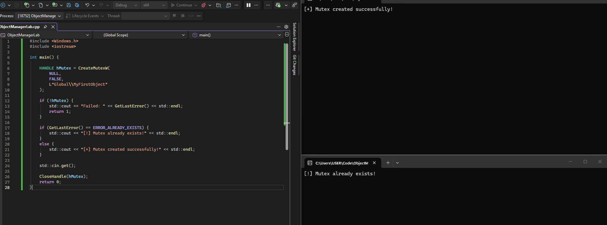
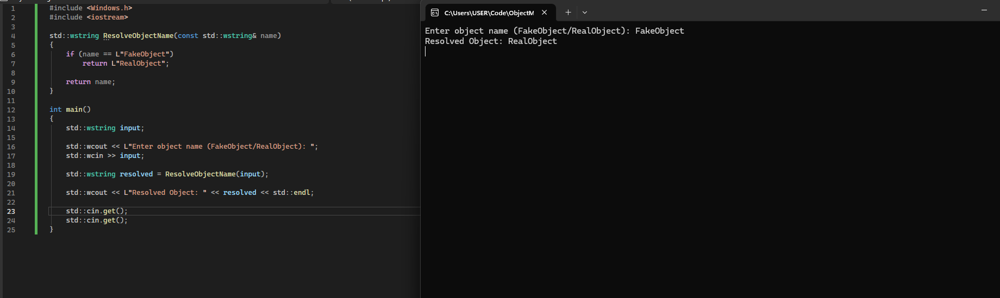
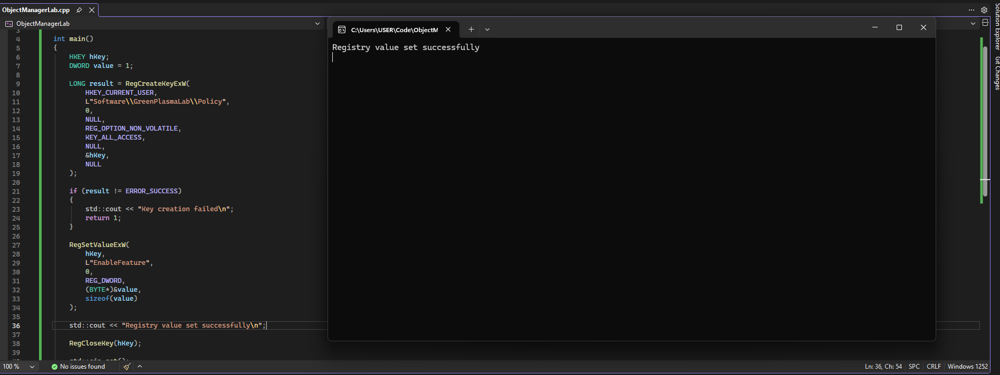
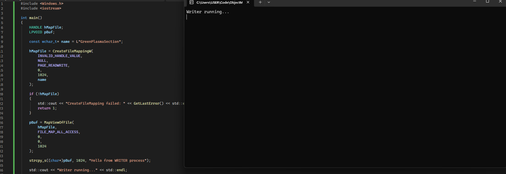

# Introduction — Understanding the GreenPlasma Technique

Most modern Windows exploits are not just a single vulnerability.
They are usually a chain of smaller Windows internals “primitives” working together:

* Object Manager symbolic links
* Shared memory sections
* Registry links
* Named object squatting
* Access control manipulation

The recently disclosed **GreenPlasma** technique is a great example of this.
While the public PoC is relatively small, it abuses several powerful Windows internals concepts that are also commonly seen in malware and offensive security research.

This blog is not about simply running a PoC.
Instead, the goal is to understand:

* *Why does this work?*
* *How do these Windows internals behave?*
* *Why do attackers abuse them?*
* *How can we observe them in a lab?*

Even though Microsoft has already patched the issue, the underlying concepts are still extremely relevant because the same techniques continue to appear in:

* Malware
* EDR Bypasses
* Privilege Escalation Research
* Post-exploitation Frameworks

Before understanding the exploit itself, we first need to understand one of the most important parts of Windows internals.

## The Windows Object Manager

One of the most important — and least understood — components inside Windows is the **Object Manager**.

Almost everything in Windows is internally treated as an *object*:

* files
* processes
* threads
* events
* mutexes
* shared memory sections
* symbolic links

These objects exist inside a special kernel-managed namespace that looks surprisingly similar to a filesystem.

For example:

```text id="tt7g2r"
\Sessions\1\BaseNamedObjects\
```

This is a real Object Manager path used by Windows to store named kernel objects for a user session.

Applications constantly create objects here for:

* inter-process communication (IPC)
* synchronization
* shared memory
* session handling

This becomes interesting from a security perspective because many privileged Windows processes also trust and interact with objects inside these namespaces.

If an attacker can:

* create an object before a privileged process does,
* redirect an object using symbolic links,
* or manipulate how objects are resolved,

they may be able to influence the behavior of higher-privileged processes.

This general technique is commonly known as:

> **Named Object Squatting**

and it is one of the core ideas behind the GreenPlasma technique.

## Viewing the Object Namespace

Windows does not expose Object Manager paths directly in File Explorer, but we can inspect them using WinObj.

After launching WinObj, navigate to:

```text id="pnd3s6"
Sessions -> <Your Session ID> -> BaseNamedObjects
```

You will immediately notice hundreds of objects created by:

* Windows itself
* browsers
* antivirus software
* messaging apps
* game launchers
* system services

Some common object types include:

| Type         | Purpose                    |
| ------------ | -------------------------- |
| Event        | Process synchronization    |
| Mutex        | Prevent multiple instances |
| Section      | Shared memory              |
| SymbolicLink | Object redirection         |

This namespace is heavily used by Windows internals — which also makes it a valuable target for attackers.

### Creating Our First Named Object

Let’s create a simple named mutex and observe it inside the Object Manager.

```cpp id="mtnp81"
#include <Windows.h>
#include <iostream>

int main() {

    HANDLE hMutex = CreateMutexW(
        NULL,
        FALSE,
        L"Global\\MyFirstObject"
    );

    if (!hMutex) {
        std::cout << "Failed: " << GetLastError() << std::endl;
        return 1;
    }

    std::cout << "Mutex created!" << std::endl;
    std::cin.get();

    CloseHandle(hMutex);
    return 0;
}
```

Compile and run the program in Microsoft Visual Studio.

Now open WinObj and navigate to:

```text id="4c9kz1"
\BaseNamedObjects
```

You should see:

```text id="ewffw5"
MyFirstObject
```

Congratulations — you just created your first Object Manager object.


### Why This Matters for Exploitation

At first glance, this may look harmless.

But many Windows components trust named objects for:

* synchronization
* shared memory
* state tracking
* session communication

If an attacker predicts an object name before a privileged process creates it, they may be able to:

* hijack communication,
* redirect object access,
* force privileged processes into attacker-controlled objects,
* or abuse race conditions.

And this is where GreenPlasma starts becoming interesting.

## Understanding Named Object Squatting

Now that we know how Windows named objects work, we can move to the first real exploitation concept behind GreenPlasma:

> **Named Object Squatting**

This technique abuses a very simple idea:

> *What happens if an attacker creates a trusted object before a privileged process does?*

Many Windows applications assume that:

* an object with a specific name does not already exist,
* or that the object was created by a trusted process.

In reality, Windows usually does **not** verify who originally created the object.

This means attackers can sometimes:

* pre-create objects,
* hijack communication,
* redirect privileged operations,
* or force applications into interacting with attacker-controlled objects.

### How Mutex Squatting Works

Let’s modify our previous program slightly.

Instead of simply creating a mutex, we’ll check whether the object already existed.

Replace your code with:

```cpp id="9y2n6p"
#include <Windows.h>
#include <iostream>

int main() {

    HANDLE hMutex = CreateMutexW(
        NULL,
        FALSE,
        L"Global\\MyFirstObject"
    );

    if (!hMutex) {
        std::cout << "Failed: " << GetLastError() << std::endl;
        return 1;
    }

    if (GetLastError() == ERROR_ALREADY_EXISTS) {
        std::cout << "[!] Mutex already exists!" << std::endl;
    }
    else {
        std::cout << "[+] Mutex created successfully!" << std::endl;
    }

    std::cin.get();

    CloseHandle(hMutex);
    return 0;
}
```

### Running the Experiment

#### Step 1 — Run the First Instance

Start the program normally.

You should see:

```text id="fwcjlwm"
[+] Mutex created successfully!
```

Keep the program running.

#### Step 2 — Run a Second Instance

Now launch the same executable again.

This time you should see:

```text id="7wt6ka"
[!] Mutex already exists!
```



Why?

Because the first process already created the named object inside:

```text id="6n7khm"
\BaseNamedObjects
```

The second process simply opened the existing object.

### Why This Matters for Security

This behavior becomes dangerous when:

* privileged services,
* SYSTEM processes,
* or security products

blindly trust named objects.

If attackers know the object name beforehand, they can:

* create it first,
* control permissions,
* manipulate communication,
* or redirect operations.

This exact pattern appears constantly in Windows exploitation research.

### Real-World Example

The GreenPlasma PoC abuses this concept using an object name similar to:

```text id="7zt9bh"
CTF.AsmListCache.FMPWinlogon
```

The exploit attempts to create or manipulate an object before a privileged Windows component interacts with it.

This is why understanding Object Manager namespaces is so important.

Attackers are not “hacking magic kernel memory.”

Often, they are simply abusing:

* trust assumptions,
* predictable object names,
* and Windows internals behavior.

## Object Manager Symbolic Links — The Real Power Primitive

So far, we have only dealt with named objects like mutexes, which are straightforward:

* create object
* open object
* detect if it already exists

However, Windows has a much more powerful mechanism inside the Object Manager:

> **Symbolic Links**

These are not filesystem shortcuts like `.lnk` files.

Instead, they are **kernel-level redirections inside the Object Manager namespace itself**.

This means one object path can silently redirect to another.

For example:

```text id="sym1"
\BaseNamedObjects\FakeObject
        ↓
\BaseNamedObjects\RealObject
```

Any process that opens `FakeObject` will actually receive `RealObject`.

Here is a small C++ code for the demo:

```cpp
#include <Windows.h>
#include <iostream>

std::wstring ResolveObjectName(const std::wstring& name)
{
    if (name == L"FakeObject")
        return L"RealObject";

    return name;
}

int main()
{
    std::wstring input;

    std::wcout << L"Enter object name (FakeObject/RealObject): ";
    std::wcin >> input;

    std::wstring resolved = ResolveObjectName(input);

    std::wcout << L"Resolved Object: " << resolved << std::endl;

    std::cin.get();
    std::cin.get();
}
```

This program demonstrates the idea of name redirection, similar to how Object Manager symbolic links work internally in Windows.

- The user enters an object name
- The program checks if it matches a predefined “fake” object
- If it does, it transparently redirects it to another object name
- Otherwise, it returns the original name



### Illustration diagram

```
        ┌──────────────────────────────┐
        │   Application Process        │
        │                              │
        │  Open:                       │
        │  \BaseNamedObjects\FakeObj  │
        └──────────────┬───────────────┘
                       │
                       ▼
        ┌──────────────────────────────┐
        │   Windows Object Manager     │
        │                              │
        │  Resolves object path        │
        └──────────────┬───────────────┘
                       │
          Checks if path is a Symbolic Link
                       │
                       ▼
        ┌──────────────────────────────┐
        │ Symbolic Link Entry Exists?  │
        │                              │
        │ FakeObj → RealObj            │
        └──────────────┬───────────────┘
                       │
                       ▼
        ┌──────────────────────────────┐
        │  Redirect Resolution          │
        │                              │
        │ FakeObj is mapped to         │
        │ RealObj automatically        │
        └──────────────┬───────────────┘
                       │
                       ▼
        ┌──────────────────────────────┐
        │   Final Object Returned      │
        │                              │
        │ \BaseNamedObjects\RealObj    │
        └──────────────────────────────┘
```

### Why This is Dangerous

Unlike normal APIs, Object Manager resolution is:

* automatic
* invisible to applications
* trusted by default

So if an attacker can influence this mapping, they can:

* redirect object access
* confuse privileged services
* manipulate IPC communication
* interfere with system assumptions

This is one of the core ideas behind GreenPlasma.

### How Windows Resolves Objects

When a process accesses an object, Windows does:

1. Parse object path
2. Look inside Object Manager namespace
3. Check if object is a symbolic link
4. If yes → resolve target path
5. Return final object handle

This happens transparently to the application.

If an attacker can control symbolic link creation, they can:

* make a privileged process think it is opening object A
* while actually giving it object B

This breaks the fundamental assumption most Windows programs rely on:

> “Object names are reliable identifiers.”

### Visualizing It in WinObj

You can inspect symbolic links using:

WinObj

Look for objects under:

```text id="sym2"
\GLOBAL??
\Sessions\<ID>\
```

You will often see:

* device redirects
* session-based mappings
* internal Windows shortcuts

### Connection to GreenPlasma

The GreenPlasma technique extends this idea by combining:

* Object squatting (previous section)
* Symbolic link redirection
* Registry link abuse
* Shared memory sections

This combination allows attackers to:

* manipulate object resolution flow
* influence privileged Windows components
* create race-condition-based exploitation paths

## Registry Symbolic Links (REG_LINK) — Redirecting Windows Policy Paths

So far, we’ve seen how Object Manager symbolic links can redirect object resolution.

Now we shift to something even more subtle — and more dangerous in real systems:

> **Registry symbolic links**

Unlike normal registry keys, Windows supports a special type of key that behaves like a **pointer to another registry location**.

### What is a Registry Symbolic Link?

A registry symbolic link does not store values itself.

Instead, it points to another registry path:

```text id="r1"
HKCU\Software\A  ─────►  HKCU\Software\B
```

So when a process reads `A`, Windows silently redirects it to `B`.

Most applications trust registry paths for:

* security policies
* configuration state
* system behavior flags

If an attacker can redirect these paths, they can:

* change perceived policy settings
* manipulate application behavior
* influence privileged components
* bypass expected security constraints

This is one of the key building blocks used in GreenPlasma.

Here is the C++ code for creating the registry key:

```cpp
#include <Windows.h>
#include <iostream>

int main()
{
    HKEY hKey;
    DWORD value = 1;

    LONG result = RegCreateKeyExW(
        HKEY_CURRENT_USER,
        L"Software\\GreenPlasmaLab\\Policy",
        0,
        NULL,
        REG_OPTION_NON_VOLATILE,
        KEY_ALL_ACCESS,
        NULL,
        &hKey,
        NULL
    );

    if (result != ERROR_SUCCESS)
    {
        std::cout << "Key creation failed\n";
        return 1;
    }

    RegSetValueExW(
        hKey,
        L"EnableFeature",
        0,
        REG_DWORD,
        (BYTE*)&value,
        sizeof(value)
    );

    std::cout << "Registry value set successfully\n";

    RegCloseKey(hKey);

    std::cin.get();
}
```
This program demonstrates basic registry interaction in Windows.

- It creates a registry key under the current user hive
- It writes a configuration value (EnableFeature = 1)
- This simulates how applications store policy or feature flags in the registry



### Visual on how this happens

```
        id="reg1"
          ┌──────────────────────────────┐
          │   Application / Service      │
          │                              │
          │ Reads registry key:         │
          │ HKCU\Software\Policies\X    │
          └──────────────┬───────────────┘
                         │
                         ▼
          ┌──────────────────────────────┐
          │   Windows Registry Engine    │
          │                              │
          │ Checks key type             │
          └──────────────┬───────────────┘
                         │
         If REG_LINK exists
                         │
                         ▼
          ┌──────────────────────────────┐
          │   Redirect Resolution        │
          │                              │
          │ Policies\X → Policies\Y     │
          └──────────────┬───────────────┘
                         │
                         ▼
          ┌──────────────────────────────┐
          │   Final Values Returned      │
          │ (from target key)           │
          └──────────────────────────────┘
```

This means:

> If you control the mapping, you can control what a system *believes* its policy is.

### Connection to GreenPlasma

In GreenPlasma-like behavior, registry redirection is used alongside:

* Object Manager symbolic links
* Section objects (shared memory)
* Named object squatting

This creates a chain where:

```text id="chain1"
Object resolution → registry redirection → policy manipulation → privileged behavior influence
```

### Important Registry Path (Example from The PoC)

The earlier code uses:

```text id="p1"
HKCU\Software\Policies\Microsoft\CloudFiles
```

and:

```text id="p2"
HKCU\Software\Microsoft\Windows\CurrentVersion\Policies\System
```

These are sensitive policy locations because Windows and system components may rely on them for behavior decisions.

Then they can shift system behavior **without direct code execution in kernel space**.

This is why registry link abuse is considered a powerful post-exploitation primitive.

### What We Have Now Built

At this point, you understand 3 core primitives:

* Named Object Squatting
* Object Manager Symbolic Links
* Registry Symbolic Links

These are the **foundation layer of GreenPlasma-style exploitation**.

## Section Objects — Shared Memory and Cross-Process Trust Abuse

So far, we’ve looked at:

* Named objects (mutex squatting)
* Object manager symbolic links
* registry symbolic links

Now we move into something much closer to real exploitation mechanics:

> **Section Objects**

### What is a Section Object?

A section object is a Windows kernel construct used for:

* shared memory
* file mapping
* inter-process communication (IPC)
* performance optimization

In simple terms:

> It allows multiple processes to “see” the same memory.

### How It Works Conceptually

```text id="sec1"
        ┌──────────────────────────────┐
        │   Process A                  │
        │   (Creator)                  │
        └──────────────┬───────────────┘
                       │
                       │ Creates Section Object
                       ▼
        ┌──────────────────────────────┐
        │   Kernel Section Object      │
        │                              │
        │   Shared Memory Region       │
        └──────────────┬───────────────┘
                       │
        ┌──────────────┴───────────────┐
        ▼                              ▼
┌──────────────────┐        ┌──────────────────┐
│   Process A      │        │   Process B      │
│ (Writer/Reader)  │        │ (Reader/Writer)  │
└──────────────────┘        └──────────────────┘
```

### Why This Becomes Dangerous

The key issue is:

> Multiple processes can share memory without strong identity guarantees.

So if attackers can:

* control a section object name
* influence mapping behavior
* or insert themselves into IPC flows

They may be able to:

* inject data into privileged processes
* modify shared state
* interfere with execution logic
* or race trusted components

Below is the program to create the shared section:

```cpp
#include <Windows.h>
#include <iostream>

int main()
{
    HANDLE hMapFile;
    LPVOID pBuf;

    const wchar_t* name = L"GreenPlasmaSection";

    hMapFile = CreateFileMappingW(
        INVALID_HANDLE_VALUE,
        NULL,
        PAGE_READWRITE,
        0,
        1024,
        name
    );

    if (!hMapFile)
    {
        std::cout << "CreateFileMapping failed: " << GetLastError() << std::endl;
        return 1;
    }

    pBuf = MapViewOfFile(
        hMapFile,
        FILE_MAP_ALL_ACCESS,
        0,
        0,
        1024
    );

    strcpy_s((char*)pBuf, 1024, "Hello from WRITER process");

    std::cout << "Writer running..." << std::endl;

    std::cin.get();

    UnmapViewOfFile(pBuf);
    CloseHandle(hMapFile);
}
```
This program creates a shared memory section object and writes data into it.

- A named shared memory region is created (GreenPlasmaSection)
- The process maps this memory into its address space
- It writes a string into the shared memory
- Any other process opening the same name can read the same data



### Visual Exploitation Model

```
        id="sec2"
Process A (trusted)       Process B (attacker)

       │                         │
       │  Opens Section Object   │
       │────────────────────────▶│
       │                         │
       ▼                         ▼

   Shared Memory Region (SECTION OBJECT)

       ▲───────────── modified data ─────────────▲
```

### Where GreenPlasma Fits

In techniques like GreenPlasma:

Section objects are combined with:

* Object Manager symbolic links
* registry redirection
* named object squatting

This creates a chain like:

```text id="chain2"
Name resolution → redirect → shared memory → privileged consumer reads attacker-influenced data
```

### Real Windows API Behind It

GreenPlasma-style techniques often rely on:

```cpp id="secapi"
NtCreateSection
NtOpenSection
NtMapViewOfSection
```

These are **lower-level NT APIs** that expose full control over memory mapping.

### How This Connects Everything

At this point, GreenPlasma-style exploitation becomes clear:

```text id="finalchain"
1. Object Squatting
        ↓
2. Object Manager Symbolic Link
        ↓
3. Registry Symbolic Link
        ↓
4. Section Object Abuse
        ↓
5. Privileged process consumes attacker-influenced state
```

## Understanding the GreenPlasma Chain (End-to-End View)

Now that we have explored each primitive individually, it's time to connect them into a single coherent attack chain — exactly as the GreenPlasma PoC does.

GreenPlasma is not a single exploit technique. It is a **composition of the four primitives we just learned**, wired together in a precise sequence to escalate privilege from a standard user.

Let's walk through exactly how each piece fits.

### The Problem the Attacker Faces

A standard Windows user cannot:

- Write to protected registry policy keys
- Obtain handles to privileged shared memory sections
- Influence the behavior of SYSTEM-level processes like Winlogon

GreenPlasma solves all three — without a single memory corruption bug.

### Stage 1 — Object Manager Symlink Hijack (Named Object Squatting + Symbolic Link)

This is where our first two primitives combine.

The Windows CTF framework (used by Winlogon for input processing) creates a shared memory section with a **predictable name**:

```text
\Sessions\<ID>\BaseNamedObjects\CTF.AsmListCache.FMPWinlogon<ID>
```

The PoC races ahead and creates an **Object Manager symbolic link** at that exact path, pointing it to an attacker-controlled target:

```text
CTF.AsmListCache.FMPWinlogon1  ──symlink──►  \BaseNamedObjects\CTFMON_DEAD
```

This is the Named Object Squatting we practiced with mutexes — but now applied to a section name that a **SYSTEM process trusts**.

```text
        ┌──────────────────────────────────┐
        │   Attacker (Standard User)       │
        │                                  │
        │   NtCreateSymbolicLinkObject()   │
        │   Creates symlink at:            │
        │   CTF.AsmListCache.FMPWinlogon1  │
        │          │                       │
        │          ▼                       │
        │   Points to attacker target      │
        └──────────────────────────────────┘
```

At this point, any privileged process that opens the CTF section will **follow the symlink** and open the attacker's object instead.

### Stage 2 — Triggering the Privileged Consumer

The PoC now needs a privileged process to actually open that hijacked section.

It does this by launching a UAC elevation prompt:

```cpp
shi.lpVerb = L"runas";
shi.lpFile = L"C:\\Windows\\System32\\conhost.exe";
ShellExecuteEx(&shi);
```

When the UAC dialog appears, **Winlogon activates** and initializes the CTF framework for the secure desktop. As part of this initialization, Winlogon opens the CTF shared memory section — but the symlink redirects it.

The PoC busy-waits until this happens:

```cpp
do {
    _NtOpenSection(&hmapping, MAXIMUM_ALLOWED, &objattr);
} while (!hmapping);
```

Once the loop exits, the attacker holds a **section handle with elevated access** — obtained because the privileged process created the underlying object.

```text
        ┌─────────────────────┐         ┌─────────────────────┐
        │   Attacker Process  │         │   Winlogon (SYSTEM)  │
        │                     │         │                      │
        │  Symlink exists at  │         │  Opens CTF section   │
        │  CTF.AsmListCache   │────────►│  Follows symlink     │
        │         │           │         │  Creates real object │
        │         ▼           │         └──────────────────────┘
        │  NtOpenSection()    │
        │  Gets handle with   │
        │  MAXIMUM_ALLOWED    │
        └─────────────────────┘
```

This is the **Section Object abuse** we studied — but weaponized through the symlink redirection layer

### Stage 3 — Registry Symlink Chain (ACL Manipulation + Registry Redirection)

Now the PoC pivots to a completely different attack surface to achieve a second goal: **writing to a protected registry key**.

The target is:

```text
HKCU\Software\Microsoft\Windows\CurrentVersion\Policies\System
```

A standard user **cannot write here** because the DACL restricts access.

The PoC solves this through a three-step registry chain:

#### Step 3a — Abuse CfAbortOperation to Create Policy Infrastructure

```cpp
CfAbortOperation(GetCurrentProcessId(), NULL, 0x2);
```

This Cloud Files API call triggers the system to interact with:

```text
HKCU\Software\Policies\Microsoft\CloudFiles\BlockedApps
```

This creates the key path with ACLs that the current user can influence.

#### Step 3b — Replace BlockedApps with a Registry Symbolic Link

The PoC deletes `BlockedApps` and recreates it as a **registry symbolic link**:

```cpp
RegCreateKeyEx(..., REG_OPTION_CREATE_LINK | REG_OPTION_VOLATILE, ...);
```

The link target is set to the **protected policy key**:

```text
BlockedApps  ──REG_LINK──►  \REGISTRY\USER\<SID>\...\Policies\System
```

This is exactly the registry symlink primitive we practiced — but now pointed at a security-sensitive location.

#### Step 3c — ACL Reset Follows the Symlink

Now comes the critical trick. The PoC calls:

```cpp
TreeSetNamedSecurityInfo(
    L"CURRENT_USER\\Software\\Policies\\Microsoft\\CloudFiles",
    ...
);
```

This function walks the registry tree and resets DACLs. When it encounters the `BlockedApps` key, it **follows the registry symlink** and resets the DACL on the **actual target**:

```text
HKCU\Software\Microsoft\Windows\CurrentVersion\Policies\System
```

The protected key is now writable by Everyone.

```text
        ┌──────────────────────────────────────┐
        │  CloudFiles\BlockedApps              │
        │  (Registry Symbolic Link)            │
        │           │                          │
        │           ▼  REG_LINK                │
        │  Policies\System                     │
        │  (Protected Key)                     │
        └──────────────────────────────────────┘
                    │
                    ▼
        ┌──────────────────────────────────────┐
        │  TreeSetNamedSecurityInfo()          │
        │  Follows link transparently          │
        │  Resets DACL on Policies\System      │
        │  → Now writable by Everyone          │
        └──────────────────────────────────────┘
```

#### Step 3d — Write the Policy Value

With the DACL neutralized, the PoC writes:

```cpp
RegSetValueEx(hk, L"DisableLockWorkstation", NULL, REG_DWORD, &val, sizeof(DWORD));
```

This disables the ability to lock the workstation — a policy flag that Windows enforces at the system level.

### Stage 4 — Exploiting the Desktop Switch

The final stage ties everything together.

The PoC monitors the current desktop:

```cpp
do {
    HDESK dsk = OpenInputDesktop(NULL, NULL, GENERIC_ALL);
    if (!dsk || dsk == INVALID_HANDLE_VALUE)
        break;
    CloseDesktop(dsk);
} while (1);
```

When `OpenInputDesktop` fails, it means Windows has switched to the **Secure Desktop** (the UAC prompt we triggered earlier). At this moment, the PoC calls:

```cpp
LockWorkStation();
```

But because we set `DisableLockWorkstation = 1`, this creates an **inconsistent system state** — the secure desktop is active, but the lock mechanism is suppressed.

Meanwhile, the attacker still holds the **elevated section handle** from Stage 2.

### The Complete Chain

```text
┌─────────────────────────────────────────────────────────────────┐
│                    GREENPLASMA ATTACK CHAIN                     │
├─────────────────────────────────────────────────────────────────┤
│                                                                 │
│  STAGE 1: Object Manager Symlink Hijack                        │
│  ┌───────────────────────────────────────────────────────────┐  │
│  │ Create symlink at CTF.AsmListCache.FMPWinlogon<SID>      │  │
│  │ → Redirects to attacker-controlled object                 │  │
│  │ Primitives: Named Object Squatting + ObjMgr Symlink      │  │
│  └───────────────────────────┬───────────────────────────────┘  │
│                              │                                  │
│                              ▼                                  │
│  STAGE 2: Trigger Privileged Consumer                          │
│  ┌───────────────────────────────────────────────────────────┐  │
│  │ ShellExecuteEx → runas conhost.exe → UAC prompt           │  │
│  │ Winlogon opens CTF section → follows symlink              │  │
│  │ Attacker obtains elevated section handle                  │  │
│  │ Primitives: Section Object Abuse                          │  │
│  └───────────────────────────┬───────────────────────────────┘  │
│                              │                                  │
│                              ▼                                  │
│  STAGE 3: Registry Symlink + ACL Manipulation                  │
│  ┌───────────────────────────────────────────────────────────┐  │
│  │ CfAbortOperation → creates CloudFiles policy path         │  │
│  │ Delete BlockedApps → recreate as REG_LINK                 │  │
│  │ Link target: Policies\System (protected key)              │  │
│  │ TreeSetNamedSecurityInfo follows link → resets DACL       │  │
│  │ Write DisableLockWorkstation = 1                          │  │
│  │ Primitives: Registry Symlink + ACL Abuse                  │  │
│  └───────────────────────────┬───────────────────────────────┘  │
│                              │                                  │
│                              ▼                                  │
│  STAGE 4: Desktop State Manipulation                           │
│  ┌───────────────────────────────────────────────────────────┐  │
│  │ Wait for Secure Desktop (UAC prompt active)               │  │
│  │ Call LockWorkStation() → suppressed by policy             │  │
│  │ Inconsistent system state achieved                        │  │
│  │ Elevated section handle retained                          │  │
│  └───────────────────────────────────────────────────────────┘  │
│                                                                 │
└─────────────────────────────────────────────────────────────────┘
```

The primitives we played with in the earlier sections — mutexes, symbolic links, registry keys, and section objects — are basically the “LEGO bricks” of this whole thing. GreenPlasma just snaps them together in a way that looks way more scary than it actually is once you understand each piece.

Once you know how each block behaves on its own, reading a PoC like this stops feeling like magic and starts feeling more like: *“ah okay… someone just creatively abused Windows internals again.”*

That’s the real skill here — not memorizing the exploit, but being able to look at it and mentally decompile it back into the same building blocks you already experimented with.

### References (for readers who want to go deeper)

* Microsoft Learn — Windows Object Manager overview
  [https://learn.microsoft.com/en-us/windows/win32/sysinfo/object-manager](https://learn.microsoft.com/en-us/windows/win32/sysinfo/object-manager)

* Microsoft Learn — Registry symbolic links (REG_LINK behavior)
  [https://learn.microsoft.com/en-us/windows/win32/sysinfo/registry-key-security-and-access-rights](https://learn.microsoft.com/en-us/windows/win32/sysinfo/registry-key-security-and-access-rights)

* Microsoft Learn — File mapping / Section objects
  [https://learn.microsoft.com/en-us/windows/win32/memory/file-mapping](https://learn.microsoft.com/en-us/windows/win32/memory/file-mapping)

* Green Plasma PoC
  [https://github.com/Nightmare-Eclipse/GreenPlasma/blob/main/GreenPlasma.cpp](https://github.com/Nightmare-Eclipse/GreenPlasma/blob/main/GreenPlasma.cpp)
