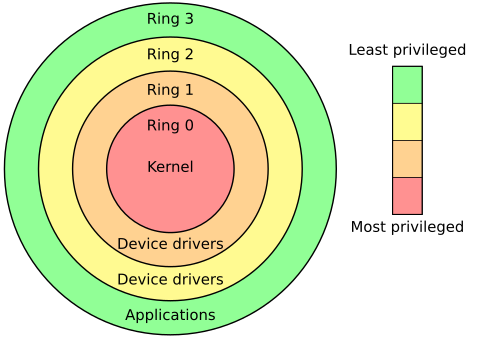
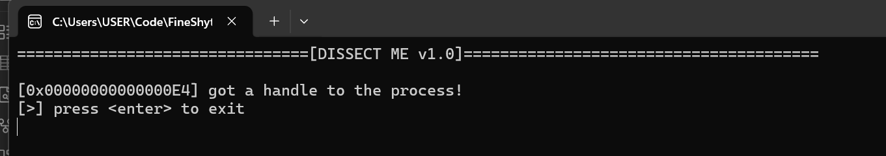
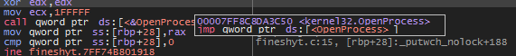
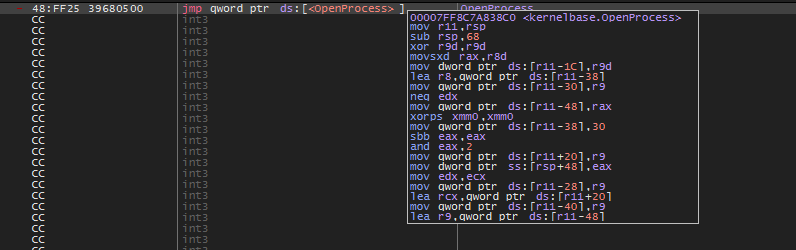
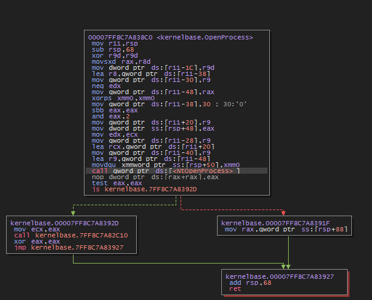
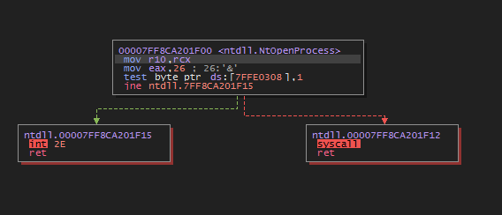
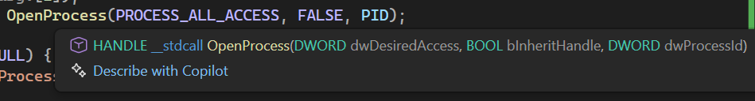
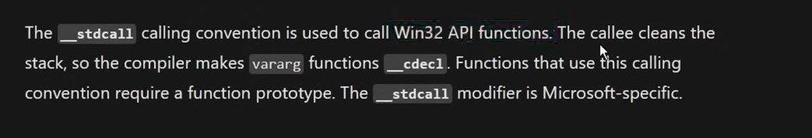
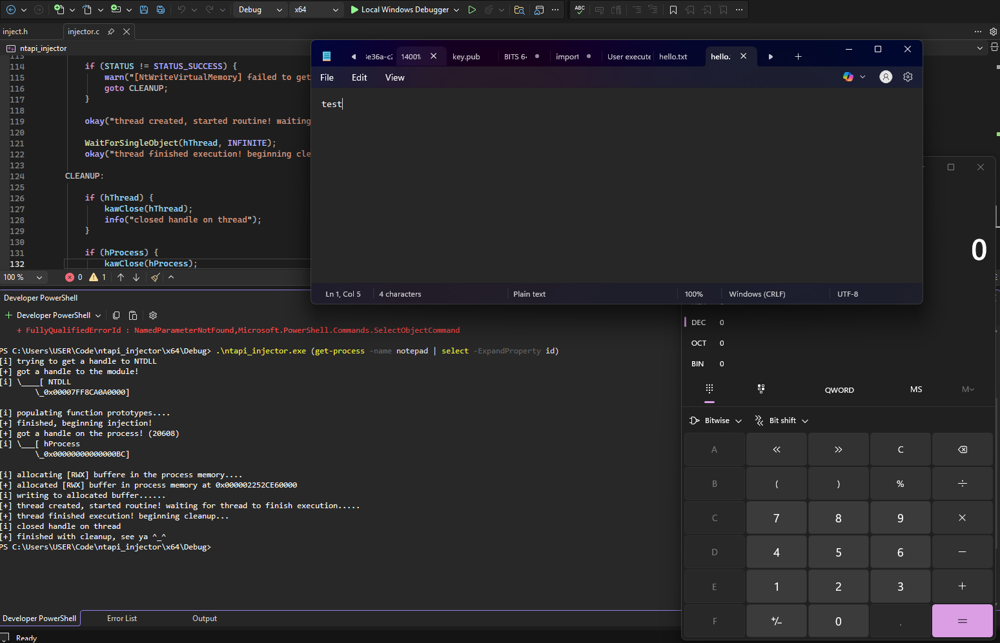

In the previous blog, we weaponized the classic Win32 process injection chain:

`OpenProcess → VirtualAllocEx → WriteProcessMemory → CreateRemoteThreadEx`

It works. It’s reliable. It’s simple.

But it’s also noisy.

Win32 APIs are well documented, widely used, and heavily monitored. Every EDR vendor knows exactly what to look for when they see that injection pattern. If you're building offensive tooling, doing red-team research, or just trying to understand how modern malware really operates, you eventually hit the same question:

**What actually happens underneath Win32?**

Today, we answer that.

We’re going one layer deeper — into the Native API exported by `ntdll.dll`. And along the way, we’ll understand exactly how execution flows through the Windows stack:

```
kernel32.dll
    ↓
kernelbase.dll
    ↓
ntdll.dll
    ↓
syscall
    ↓
ntoskrnl (Kernel)
```

We are *not* covering direct or indirect syscalls in this post. That deserves its own dedicated deep dive. Today is about understanding NTAPI — the layer just before the kernel boundary.

## Why Go Lower?

When developing offensive tooling, one principle becomes very clear:

The lower you go in the stack, the less abstraction you deal with — and typically, the less visibility you generate.

Win32 APIs are public-facing, stable, and designed for developers. That also makes them ideal choke points for monitoring and hooking. Security products hook them, instrument them, and profile them constantly.

Native APIs, on the other hand, were never designed for everyday application developers. They are internal contracts between user mode and the Windows kernel. They are less abstracted, less documented (officially), and sometimes less directly monitored — although modern EDRs absolutely keep an eye on them too.

The point isn’t invisibility. The point is understanding the real boundary between user mode and kernel mode.

## User Mode vs Kernel Mode — The Ring Model

To understand NTAPI, we first need to understand privilege separation.



Modern CPUs implement privilege rings:

| Ring   | Privilege   | Usage                                 |
| ------ | ----------- | ------------------------------------- |
| Ring 3 | Lowest      | Applications (browsers, games, tools) |
| Ring 2 | Rarely used | Theoretical driver usage              |
| Ring 1 | Rarely used | Theoretical virtualization usage      |
| Ring 0 | Highest     | Kernel                                |

Applications run in Ring 3. The kernel runs in Ring 0. That separation is intentional and fundamental.

If something crashes in Ring 3, the process dies.

If something crashes in Ring 0, the entire operating system crashes.

This separation is why system calls exist. A syscall is the controlled transition from user mode into kernel mode. It’s the only legitimate doorway across that boundary.

## What Is NTAPI?

The Native API (NTAPI) is the lowest user-mode interface before execution transitions into the kernel. It is exported by `ntdll.dll` and acts as the final user-mode layer before invoking the `syscall` instruction.

When you call:

```c
OpenProcess(PROCESS_ALL_ACCESS, FALSE, PID);
```

you are not talking directly to the kernel.

Instead, the flow looks like this:

```
OpenProcess()
    ↓
KernelBase!OpenProcess
    ↓
ntdll!NtOpenProcess
    ↓
syscall
```

Win32 APIs are wrappers. NTAPI is closer to the metal.

## Dissecting OpenProcess in a Debugger

Let’s look at a minimal program:

```c
#include <windows.h>
#include <stdio.h>

int main(int argc, char* argv[])
{
	if (argc < 2) {
		puts("Usage: fineshyt.exe <PID>");
		return -1;
	}

	puts("================================[DISSECT ME v1.0]=======================================");
	DWORD PID = atoi(argv[1]);
	HANDLE hProcess = OpenProcess(PROCESS_ALL_ACCESS, FALSE, PID);

	if (hProcess == NULL) {
		printf("[OpenProcess] failed, error: 0x%lx", GetLastError());
		return -1;
	}

	printf("\n[0x%p] got a handle to the process!\n", hProcess);
	CloseHandle(hProcess);
	puts("[>] press <enter> to exit");
	(void)getchar();
	return 0;
}
```

If we run this against a notepad PID, we get:



Now let’s load this binary into x64dbg and follow `OpenProcess`.

### Step 1 - kernel32



We see execution land inside kernel32.dll.

But this is not where the real work happens.

### Step 2 - kernelbase

Following the jump:



Now we’re inside kernelbase.dll.

Still not the kernel.

### Step 3 - ntdll

Following further



Now we see a reference to NtOpenProcess.

This is where the Win32 wrapper ends.

That’s the real transition point.

### Step 4 - The NT Stub



This is the actual NTAPI syscall stub.

Every Nt* function follows a similar pattern. This is the last user-mode code executed before transitioning into the kernel.

## Calling Convention

If you hover over `OpenProcess`:



You’ll see that it uses `_stdcall`.



The calling convention defines how parameters are passed and who cleans up the stack.

In _stdcall, parameters are pushed right to left.

So for:

```c++
OpenProcess(PROCESS_ALL_ACCESS, FALSE, PID);
```

The arguments are placed on the stack in reverse order.

Understanding calling conventions becomes extremely important once you start working closer to the syscall boundary.

## Inside ntdll — The Syscall Stub

A typical `NtOpenProcess` stub looks like this:

```asm
mov     r10, rcx
mov     eax, 26h
test    byte ptr ds:[7FFE0308], 1
jne     fallback
syscall
ret
```

Let’s break this down.

### `mov r10, rcx`

The Windows syscall ABI requires that `RCX` be copied into `R10` before executing `syscall`.

Why?

Because the `syscall` instruction internally overwrites `RCX` and `R11`. Windows preserves the original first argument by copying it into `R10` manually. This is part of the syscall calling convention contract.

### `mov eax, 26h`

This loads the syscall number into `EAX`.

Each NT function corresponds to a syscall ID. For example, `NtOpenProcess` might be `0x26` on one build of Windows — but that number can change between versions.

That volatility is exactly why Microsoft does not officially document syscall numbers.

### `test byte ptr [7FFE0308h], 1`

This is the “mysterious if condition.”

The memory region starting at `0x7FFE0000` is known as **KUSER_SHARED_DATA**. It’s a special page shared between user mode and kernel mode that contains system-wide flags and configuration data.

The instruction performs a bitwise test against a specific flag. Depending on that flag, execution either proceeds to `syscall` or jumps to a fallback mechanism.

You can literally flip the Zero Flag (ZF) in a debugger and watch the control flow change.

That’s the level of control we’re dealing with here.

## NTSTATUS — A Different Return Philosophy

Unlike Win32 APIs, which often return `BOOL`, `HANDLE`, or `DWORD`, NTAPI functions return an `NTSTATUS`.

This is a 32-bit value where:

* `0x00000000` represents `STATUS_SUCCESS`
* Any other value represents informational, warning, or error conditions

NTSTATUS codes are extremely granular. There are thousands of them.

That alone tells you something important:

NTAPI was not designed for casual developers.

## Building an NTAPI-Based Process Injector

Now we rebuild the classic injection chain — but this time, we bypass the Win32 wrappers entirely.

Instead of calling:

```
OpenProcess()
VirtualAllocEx()
WriteProcessMemory()
CreateRemoteThreadEx()
CloseHandle()
```

we directly invoke:

```
NtOpenProcess()
NtAllocateVirtualMemoryEx()
NtWriteVirtualMemory()
NtCreateThreadEx()
NtClose()
```

We dynamically resolve these functions from `ntdll.dll` at runtime and call them through function pointers.

The logic remains conceptually identical. The difference is that we are now working directly with kernel structures like `OBJECT_ATTRIBUTES` and `CLIENT_ID`, which Win32 normally hides from us.

We manually populate those structures, request a handle with `NtOpenProcess`, allocate memory in the remote process using `NtAllocateVirtualMemoryEx`, write our payload with `NtWriteVirtualMemory`, and spawn execution with `NtCreateThreadEx`.

From the kernel’s perspective, the same fundamental actions occur. But from a monitoring standpoint, we’ve eliminated the high-level Win32 abstraction layer entirely.

It’s important to understand something here: this does **not** make the technique invisible. Modern EDR solutions monitor far deeper than Win32.

But it does teach you how Windows actually works.

## Execution Flow

When the injector runs against a target process like `notepad.exe`, the following sequence occurs:

First, the program resolves `ntdll.dll` and extracts the addresses of the Native API functions. It then opens a handle to the target process using `NtOpenProcess`. After that, it allocates executable memory inside the remote process using `NtAllocateVirtualMemoryEx`, writes the payload into that memory region using `NtWriteVirtualMemory`, and finally creates a remote thread with `NtCreateThreadEx`.

Once execution completes, it cleans up by closing all handles via `NtClose`.

From a behavioral standpoint, this mirrors classic injection. The only difference is that we’re operating one layer closer to the kernel boundary.

## Where to Find NTAPI Definitions

Microsoft does not officially publish many NT structures or Native API definitions. However, the research community has done extensive reverse engineering work to document them.

Three excellent resources are:

* **PHNT** – successor to Process Hacker’s headers, containing extensive NT structures and prototypes
* **NTDOC** – an interactive browser for Native API structures and functions
* **Vergilius Project** – version-specific Windows header definitions across architectures

For most research cases, these resources are more than sufficient.

## Key Takeaways

The difference between Win32 and NTAPI isn’t magic — it’s abstraction.

Win32 APIs are developer-friendly wrappers built for stability and usability. NTAPI functions are lower-level interfaces designed as internal bridges to the kernel. They require more structure setup, return `NTSTATUS` codes instead of simple booleans, and are subject to change between Windows builds.

By building an injector with NTAPI, you gain:

* A clearer understanding of how Windows transitions from user mode to kernel mode
* Insight into syscall stubs and ABI behavior
* Practical experience working with undocumented structures
* A foundation for exploring direct syscalls and advanced evasion techniques

Most importantly, you stop treating Windows as a black box.

## Results



## Final Thoughts

This post was not about bypassing detection.

It was about understanding the boundary.

By moving from Win32 into NTAPI, we step closer to the actual system call interface. We see how arguments are prepared, how syscall numbers are loaded, how user-mode transitions into kernel mode, and how Windows internally handles process manipulation.

The next logical step would be removing `ntdll` from the equation entirely and invoking syscalls directly. But that’s a story for another blog.

For now, you’ve crossed the abstraction layer — and that’s where real Windows internals begin.


**Full source code repository:**

[https://github.com/anish833/process-injection/blob/main/inject.h](https://github.com/anish833/process-injection/blob/main/inject.h)

[https://github.com/anish833/process-injection/blob/main/injector.c](https://github.com/anish833/process-injection/blob/main/injector.c)


