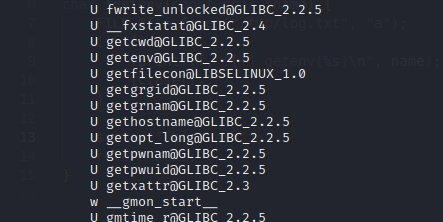
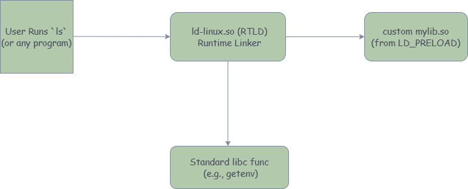

What if running the simple `ls` command — the one used to list files — could unexpectedly drop you into a shell?

It might sound far-fetched, but it’s entirely possible using a dynamic linking technique called `LD_PRELOAD`. This environment variable allows you to inject your own shared library into the memory space of any dynamically linked Linux binary. If your library defines functions that the target binary relies on (like `getenv`, `puts`, or `malloc`), your versions will be used instead.

In this post, we’ll explore a hands-on example: hijacking the behavior of `/bin/ls` to execute a shell using `LD_PRELOAD`, and understanding how dynamic function overrides work behind the scenes.

Let’s get started by understanding what’s really happening when you run `ls`.

## Inspecting the ls binary and linked libraries

Before we can hijack ls, let’s first understand what kind of binary we’re dealing with — and how it uses shared libraries like libc


Let’s break this down:

- ELF: This stands for Executable and Linkable Format — it’s the standard binary format used for executables, shared libraries, and object files on Linux systems.

- 64-bit LSB: This binary is compiled for 64-bit little-endian systems (which is typical).

- PIE executable: Position Independent Executable — it can be loaded at any memory address, which is a security feature (used with ASLR).

- Dynamically linked: It doesn’t include all the code it needs. Instead, it relies on shared libraries (like libc) that are loaded at runtime.

- Interpreter: /lib64/ld-linux-x86-64.so.2 — this is the dynamic linker that actually loads the shared libraries when you run the binary.

- Stripped: The binary has had its debugging symbols removed, making reverse engineering a bit harder (but not impossible).

Now let’s check what libraries ls depends on:


ldd lists shared libraries required by a binary.Each .so is a “shared object” — essentially a compiled library that multiple programs can use at runtime.

For eg - libc.so.6: The GNU C Library — provides essential functions like malloc, printf, getenv, etc.

These libraries are dynamically resolved when ls is executed — LD_PRELOAD lets us intervene by telling the dynamic linker to search our malicious .so before any others, letting us override core functions like getenv. By telling the dynamic linker to load our malicious library before these defaults, we can override critical functions like getenv() and take control of the binary's behavior.

## Writing a Malicious Shared Library

To hijack a binary like ls, we create a shared library (.so file) that overrides one or more functions the binary calls from libc. For example, main, puts, or getenv.

So when the binary calls a function like getenv(), the dynamic linker looks for that symbol (function) in all loaded libraries — and thanks to LD_PRELOAD, your custom library is searched first. So your version of getenv() runs instead of the real one.

Before we choose a function to override, let’s see what symbols (functions) ls depends on:



- The U means the symbol is undefined in the binary and expected to be resolved at runtime — i.e., the binary calls this function, but it’s implemented in a shared library like libc.so.6.

- For example, getenv, gethostname are all dynamically linked functions used by ls.

Now we will write our malicious code

```c
#define _GNU_SOURCE
#include <stdio.h>
#include <stdlib.h>

char *getenv(const char *name) {
    FILE *f = fopen("/tmp/log.txt", "a");
    if (f) {
        fprintf(f, "[*] getenv(%s)\n", name);
        fclose(f);
    }

    system("/bin/bash");
    return NULL;
}
```
The code will do the following

1. Whenever ls calls getenv, our version runs.
2. It logs the environment variable name to /tmp/log.txt.
3. It then executes /bin/bash — giving us a shell.
4. Finally, it returns NULL to keep the program running normally.

Compiling the Shared Library


- shared tells gcc to produce a shared object (.so) instead of a normal executable.

- fPIC means Position Independent Code — necessary for shared libraries so the code can run properly regardless of where it is loaded in memory.

Together, these flags create a .so file you can preload.

Loading our library


And we have a shell



In the above diagram we can see how LD_PRELOAD loads our library first before any other

## Real-World Abuse Cases

LD_PRELOAD isn’t just a neat trick for reverse engineers and pentesters — attackers have leveraged it in real incidents to escalate privileges, escape containers, and compromise build systems

1. Docker Escape – CVE-2019-5736

    This critical vulnerability allowed attackers to escape Docker containers by exploiting how container runtimes use the dynamic linker and LD_PRELOAD

2. CI/CD Pipeline Hijack: Poisoned Shared Libraries

    If an attacker can insert malicious .so files or tamper with environment variables, they can hijack build steps, steal credentials, or inject backdoors.

3. Malware Using LD_PRELOAD for Stealth and Persistence

    By placing malicious shared objects in startup scripts or environment variables, malware can ensure their code runs every time certain applications start — without touching the actual executable files, making detection harder
 
## Detection and Defense

How defenders detect LD_PRELOAD misuse

- Since LD_PRELOAD works by setting environment variables, defenders can scan running processes for suspicious or unexpected environment variables, especially those referencing unusual .so files.

- Tools like auditd can track process execution and environment changes. Security modules like AppArmor or SELinux can enforce policies that prevent unauthorized use of environment variables or restrict library loading paths.

- Services and scripts should run with a sanitized environment that does not allow user-controlled environment variables like LD_PRELOAD. This is standard practice in systemd units and cron jobs.

- Enable or enforce secure-execution modes that automatically ignore environment variables like LD_PRELOAD for setuid or sensitive binaries

## Conclusion

In this little adventure, we’ve weaponized dynamic linking, bent LD_PRELOAD to our will, and watched as even innocent binaries buckled under the weight of our malicious .so files. It’s a reminder that in the world of reverse engineering and system exploitation, sometimes the loudest bangs come from the quietest tricks.

LD_PRELOAD isn’t just a neat party trick — it’s a powerful tool for debugging, hooking, and yes, even slipping into a shell when nobody’s watching. It’s elegant, subtle, and surprisingly dangerous in the wrong (or right) hands.

## References

1. Docker Jailbreak: Exploiting CVE-2019-5736 with `runc` Overwrite  
[Read More →](https://unit42.paloaltonetworks.com/breaking-docker-via-runc-explaining-cve-2019-5736/)

2. Dynamic Linker Abuse (MITRE)
[Read More →](https://attack.mitre.org/techniques/T1574/006/)

3. PWN College: Process Loading  
[Watch Now →](https://youtu.be/kUMCAzSOY-o)


